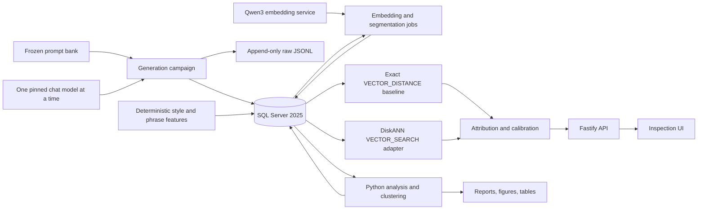

# Lab 2 Specification — ModelPrint

## Closed-set local LLM output attribution, same-source grouping, and SQL Server 2025 vector search

**Status:** Governing implementation plan for the next `aidataapps` lab.

**Proposed repository path:** `aidataapps/modelprint/`

**Proposed branch:** `aidataapps-modelprint`, created from `aidataapps-rag`

**Review basis:** The current `aidataapps/rag` lab, its pinned local-model registry, SQL Server vector implementation, benchmark artifact contract, and selected frozen prompt banks under `interpretability/` and `interpretability/jspaces/`.

**Scientific status:** This document is a plan, not a result. It does not assume that the four models have a stable output fingerprint, that semantic embeddings isolate writing style, that SQL vector distances are calibrated probabilities, or that unsupervised clusters correspond to model identity. A clean null is a successful lab result.

---

> ## Paste-line for the coding and research agent
>
> Create a new branch named `aidataapps-modelprint` from `aidataapps-rag`. Treat `aidataapps/rag/` and all frozen `interpretability/` data files as read-only inputs. Read `aidataapps/rag/README.md`, `COURSE.md`, `config/models.json`, `scripts/model-server.ts`, `scripts/benchmark.ts`, `src/inference.ts`, `src/repository.ts`, and `interpretability/how_to_design_labs.md` before writing code.
>
> Build the new lab under `aidataapps/modelprint/`. Reuse the existing SQL Server 2025 container pattern, Colab rootless runtime support, OpenAI-compatible local vLLM serving, Qwen3 embedding service, exact-search baseline, pinned model revisions, and immutable run-artifact conventions. Do not refactor or break Lab 1 as part of this work.
>
> Complete and freeze MP-0 through MP-2 before loading any of the four scientific target models. Freeze the prompt-source manifest, prompt-group split, deterministic carrier templates, exact model-profile snapshot, generation settings, primary metrics, negative controls, attribution claim thresholds, and SQL capability report. Use one chat model at a time while the embedding service remains resident.
>
> Generate outputs from Muse Glimmer 30B, Gemma 4 31B, OLMo 3.1 32B Instruct, and Qwen 3.8 27B using identical semantic prompt groups and declared model-specific chat-template adapters. Persist the request, raw response, final answer text, optional reasoning field, exact revision, serving image digest, sampling settings, seed, token counts, latency, prompt hash, output hash, and idempotency key for every row. Never mix parsed reasoning text into the primary final-answer corpus.
>
> Build exact SQL vector-search baselines before creating an approximate vector index. Treat `VECTOR_DISTANCE` as a distance, not a probability. Treat `VECTOR_SEARCH` as a candidate-retrieval operator, not a classifier or clustering algorithm. Fit and validate attribution, same-source, calibration, abstention, and clustering logic above the retrieval layer. Hold out entire prompt groups, families, carriers, and source files so the app cannot win by retrieving the same question or template.
>
> Implement three primary vector spaces: semantic output embeddings, deterministic style vectors, and prompt-conditioned residual embeddings. Implement full-output and chunk-level retrieval, explainable phrase statistics, model medoids, a calibrated hybrid classifier, pairwise same-model scoring, and batch grouping. Every user-facing attribution must return candidate models, calibrated evidence, an abstention decision, nearest-neighbor witnesses, phrase/style evidence, vector-space disagreement, and limitations.
>
> Run exact-versus-approximate recall and latency benchmarks against frozen exact neighbors. Detect the SQL Server vector-index version at runtime and support the local SQL Server 2025 legacy `TOP_N` path as well as the newer `TOP (N) WITH APPROXIMATE` path. Because the latest vector-index generation is not currently available in local SQL Server 2025, keep indexed search tables immutable after index creation and never enable stale-index behavior in the primary campaign.
>
> Write immutable row-level artifacts before aggregate reports, checkpoint generation so no completed response is lost, refuse resume on configuration drift, preserve failed rows, and route every result through the taxonomy in this specification. Finish only when the state-of-record report, claims table, SQL capability report, exact/ANN benchmark, calibration report, OOD report, cluster report, reproducibility script, and completion checklist all reconstruct from committed manifests and retained run artifacts.

---

# 0. Executive verdict

This is a strong next lab, but the useful scientific question is narrower and more interesting than “can a vector database tell me which LLM wrote this?”

The lab should ask:

> **Under a closed set of four pinned local models, what model-specific signal remains in generated text after prompt content, topic, response length, decoding settings, chat-template differences, and repeated boilerplate are controlled—and how much of that signal can SQL Server 2025 vector search retrieve efficiently without changing the attribution conclusion?**

The SQL Server vector features are a good fit for the retrieval and scale portions of the experiment:

1. store full-output, chunk-level, prompt-conditioned, and style vectors;
2. retrieve nearest known generations;
3. aggregate neighbors by model;
4. compare exact and approximate retrieval;
5. provide inspectable evidence to an attribution application.

The vector engine does **not** directly provide:

- authorship classification;
- calibrated confidence;
- open-set “unknown model” detection;
- pairwise same-source probability;
- unsupervised clustering semantics;
- protection against prompt/topic leakage;
- scientific evidence that a model has a stable fingerprint.

Those layers must be built, calibrated, and tested explicitly.

The central design risk is that a general-purpose text embedding mostly represents **what an answer is about**, not **which model produced it**. If all four models answer the same SQL question, their semantic embeddings may be closer to one another than two answers from the same model on unrelated topics. That is not a failure of SQL vector search. It is the result the lab is designed to measure.

The lab therefore compares four evidence channels rather than betting the result on one embedding:

- semantic output vectors;
- prompt-conditioned residual vectors;
- deterministic stylometric vectors;
- distinctive phrase and layout statistics.

The application combines these channels only after each has been measured independently.

---

# 1. Lab thesis

> **A vector search retrieves witnesses. It does not prove authorship.**

ModelPrint is an app-shaped empirical lab with two equally important outcomes:

1. a useful local application that can attribute or abstain on unknown outputs and group batches by likely source;
2. a reproducible experiment showing when SQL Server vector search does and does not preserve model-specific information.

The lab should feel like a small paper and a real application at the same time:

```text
Question
  -> frozen prompt and model campaign
  -> immutable generations
  -> multiple vector representations
  -> exact SQL retrieval
  -> attribution and calibration
  -> same-source verification and grouping
  -> approximate vector-index benchmark
  -> app with inspectable evidence
  -> state-of-record claims and limitations
```

---

# 2. Scope and claim ceiling

## 2.1 Primary scope

The primary task is **closed-set attribution** among exactly these pinned profiles from the existing Lab 1 registry:

- `muse-glimmer-30b`
- `gemma-4-31b`
- `olmo-3.1-32b-instruct`
- `qwen-3.8-27b`

The primary output corpus is English, benign, locally generated, and produced through the same OpenAI-compatible serving boundary.

## 2.2 Secondary tasks

The same data supports:

- pairwise verification: “Are these two outputs likely from the same one of the four models?”
- batch grouping: “How many likely sources are represented, and which outputs group together?”
- family-level attribution: Gemma vs Muse vs OLMo vs Qwen;
- robustness under prompt, carrier, decoding, length, and normalization shifts;
- exact-versus-approximate SQL vector-search comparison.

## 2.3 Explicit non-goals

Do not present the lab as:

- a universal AI-text detector;
- a reliable human-vs-machine detector;
- proof of model ownership;
- a plagiarism detector;
- an academic-misconduct detector;
- a production forensic system;
- a detector for edited, translated, heavily paraphrased, or mixed-author text;
- evidence that a particular phrase is uniquely generated by one model;
- a guarantee that future revisions of a model preserve the same signature.

## 2.4 Model identity is versioned

A label means the complete served profile, not merely a marketing family name:

```text
model repository
+ exact revision
+ tokenizer and chat template
+ system-role policy
+ reasoning parser policy
+ vLLM image digest
+ engine arguments
+ precision / quantization
+ generation settings
```

The application must display this distinction. “Qwen” is not the same scientific object as `Qwen/Qwen3.8-27B@<revision>` served under the frozen profile.

---

# 3. Core research questions

## RQ1 — Is there a model signal after prompt control?

When the same prompt is answered by all four models, and test prompts come from held-out groups and families, can an attribution method perform above chance?

## RQ2 — What does each vector space encode?

Do semantic vectors primarily group by prompt/topic, while style vectors or prompt-conditioned residual vectors group more strongly by model?

## RQ3 — Does chunking help?

For long responses, does paragraph or token-window voting improve attribution, calibration, and same-source verification relative to one full-output vector?

## RQ4 — Does the signal transfer?

Does a detector trained on one set of prompt families, carrier templates, and decoding settings retain performance on:

- held-out prompt groups;
- held-out prompt families;
- held-out source files;
- a held-out response carrier;
- higher-temperature generations;
- shorter and longer outputs;
- deterministic text transformations?

## RQ5 — Can the system abstain honestly?

Can a calibrated system maintain useful selective accuracy while declining to identify ambiguous or out-of-distribution outputs?

## RQ6 — Can SQL approximate search preserve the conclusion?

At corpus sizes where approximate search is justified, how much nearest-neighbor recall, prediction agreement, and latency change result from SQL Server’s DiskANN path?

## RQ7 — Do unsupervised groups correspond to models?

When labels are hidden during clustering, do clusters align more with model identity than with prompt family, topic, response carrier, or length?

## RQ8 — Can pairs and batches be grouped?

Can a calibrated pairwise model distinguish same-model from different-model pairs under hard controls, and can those scores support stable batch grouping?

---

# 4. Frozen hypotheses

These are hypotheses, not expected results.

## H1 — Semantic prompt dominance

Whole-output semantic embeddings will align more strongly with prompt family and topic than with model identity, especially for short or tightly constrained answers.

**Falsifier:** model-label retrieval and clustering remain strong on held-out families while prompt/topic association is weak.

## H2 — Style-vector gain

A deterministic style vector that emphasizes layout, punctuation, function words, sentence structure, and hashed n-grams will improve held-out model attribution over semantic vectors alone.

**Falsifier:** style-vector performance is at chance or loses to semantic vectors after leakage controls.

## H3 — Prompt-conditioned gain

For prompt-aware queries, a normalized output-minus-prompt embedding will reduce semantic-content dominance and improve model retrieval.

**Falsifier:** it is unstable, degrades performance, or only helps when the same prompt/template appears in training.

## H4 — Length dependence

Attribution and same-source accuracy will increase with usable output length.

**Falsifier:** short outputs perform equally well after class and prompt controls.

## H5 — Decode fragility

A detector trained only on deterministic generations will degrade on natural-temperature generations.

**Falsifier:** performance and calibration transfer without material loss.

## H6 — Chunk-vote benefit

For medium and long outputs, chunk-level evidence aggregation will improve selective accuracy or calibration.

**Falsifier:** chunking adds correlated noise, duplicate-neighbor bias, or no measurable benefit.

## H7 — Hybrid selective attribution

A calibrated hybrid of SQL neighbor evidence, style features, phrase evidence, and chunk agreement will support a useful accuracy/coverage frontier with abstention.

**Falsifier:** the hybrid is not better than the strongest single channel on frozen tests.

## H8 — ANN preservation

At the full tier, approximate retrieval will improve query latency while preserving high top-k recall and nearly all final attribution decisions.

**Falsifier:** recall, class-vote agreement, or calibrated decisions materially diverge from exact search.

---

# 5. Evidence and result taxonomy

Every model, split, vector space, and experiment receives one or more explicit dispositions.

| Taxonomy | Meaning |
|---|---|
| `CLEAN_NULL` | No supported model-attribution signal under the tested design. |
| `PROMPT_DOMINATED` | Retrieval or clusters align with prompt/topic more than model. |
| `SHORT_TEXT_INSUFFICIENT` | Signal is not usable below a declared length band. |
| `CLOSED_SET_SIGNAL` | Model identity is decodable above chance on held-out prompts. |
| `FAMILY_ONLY_SIGNAL` | Family is identifiable, but exact profile is not. |
| `DECODE_FRAGILE` | Signal fails under a decoding-setting shift. |
| `CARRIER_FRAGILE` | Signal fails under a held-out response-format carrier. |
| `SELECTIVE_ATTRIBUTION` | A calibrated abstaining classifier reaches the declared accuracy/coverage gate. |
| `SAME_SOURCE_SIGNAL` | Pairwise same-model verification passes its held-out hard-negative gate. |
| `MODEL_ALIGNED_CLUSTERS` | Unsupervised clusters align with model more than prompt nuisance labels. |
| `CLUSTER_VISUAL_ONLY` | A projection looks separated, but cluster metrics do not support a claim. |
| `OOD_UNRELIABLE` | Unknown sources are confidently forced into known classes too often. |
| `ANN_PRESERVES` | ANN meets recall and prediction-agreement gates. |
| `ANN_DISTORTS` | ANN changes evidence or decisions beyond the declared tolerance. |
| `STOP_PORT` | A model failed its serving/template/output gate. |
| `STOP_DATA` | Prompt or generation integrity failed. |
| `STOP_CAPABILITY` | The local SQL build cannot exercise the requested ANN feature. |
| `STOP_BUDGET` | A declared optional tier was not run; completed cells remain valid. |

No positive outcome is required for completion.

---

# 6. Repository strategy

## 6.1 New lab, read-only predecessor

Create:

```text
aidataapps/modelprint/
```

Do not modify the scientific behavior of `aidataapps/rag/` while building this lab.

## 6.2 Reuse without destabilizing Lab 1

The new lab should reuse the implementation pattern but remain independently reproducible.

Required approach:

1. copy the model registry into `modelprint/config/models.json`;
2. record the source path and SHA-256 of the Lab 1 registry;
3. add a `scripts/sync-model-registry.ts` audit command;
4. fail if the frozen copy changes without a schema/version bump;
5. copy or minimally adapt the model-server and Colab runtime scripts;
6. defer a cross-lab shared-runtime refactor until both labs pass independently.

This avoids turning the scientific lab into a repository-wide refactor.

## 6.3 Proposed source layout

```text
aidataapps/modelprint/
  README.md
  COURSE.md
  SPEC.md
  VALIDATION.md
  CLAIMS.md
  .env.example
  compose.yaml
  compose.colab.yaml
  package.json
  package-lock.json
  tsconfig.json
  pyproject.toml
  uv.lock                         # or a fully pinned requirements lock
  config/
    models.json
    campaigns/
      smoke.json
      dev.json
      standard.json
      full.json
    carriers.json
    prompt-sources.json
    feature-schema-style512.json
    thresholds.json               # created only by freeze command
  data/
    prompt-catalog.jsonl
    prompt-split-manifest.json
    source-manifest.json
    ood/
      human-authored-controls.jsonl
      transformed-controls.jsonl
  db/
    001_schema.sql
    010_views.sql
    020_procedures.sql
    900_enable_vector_preview.sql
    910_build_vector_indexes.sql   # run post-load, never as ordinary migration
    920_drop_vector_indexes.sql
  scripts/
    colab-host-init.sh
    env-init.sh
    env-down.sh
    runtime-env.sh
    model-server.ts
    doctor.ts
    sync-model-registry.ts
    build-prompt-bank.ts
    freeze-campaign.ts
    generate.ts
    embed.ts
    build-style-vectors.ts
    build-phrase-stats.ts
    build-vector-corpus.ts
    vector-index.ts
    evaluate-exact.ts
    evaluate-ann.ts
    smoke.ts
    repro.sh
  src/
    app.ts
    server.ts
    config.ts
    models.ts
    inference.ts
    prompt-bank.ts
    generation.ts
    embeddings.ts
    style-vector.ts
    phrase-evidence.ts
    repository.ts
    search/
      exact.ts
      ann-legacy.ts
      ann-v3.ts
      adapter.ts
      aggregate.ts
    attribution/
      features.ts
      classifier.ts
      calibration.ts
      conformal.ts
      ood.ts
      pairwise.ts
      grouping.ts
    contracts.ts
    types.ts
  analysis/
    modelprint_analysis/
      io.py
      geometry.py
      baselines.py
      train.py
      calibrate.py
      pairs.py
      cluster.py
      ann.py
      plots.py
      report.py
    tests/
  web/
    src/
      pages/
        Dashboard.tsx
        Identify.tsx
        Compare.tsx
        Group.tsx
        Explore.tsx
        Clusters.tsx
        VectorIndex.tsx
  tests/
    unit/
    contract/
    integration/
    fixtures/
  runs/
    .gitkeep
```

The CLI and API are authoritative. The web app is a thin inspection layer over the same contracts.

---

# 7. Runtime architecture



## 7.1 Services

- SQL Server 2025 Developer container.
- One local chat-model vLLM service at a time.
- One persistent embedding-model vLLM service.
- TypeScript generation/API process.
- Python analysis process.
- Optional React/Vite UI.

## 7.2 Embedding service

Retain the current Lab 1 default for the primary semantic vector:

```text
Qwen/Qwen3-Embedding-0.6B
dimensions = 1024
```

The embedding model and exact serving image are part of every vector-corpus manifest.

## 7.3 Model residency

Only one of the four large chat models is resident at a time. The prompt bank, generation settings, and database remain fixed while profiles rotate sequentially.

---

# 8. Prompt-bank design

## 8.1 Primary principle

The prompt bank is designed for **controlled breadth**, not uncontrolled volume.

Start with frozen, provenance-rich prompt seeds from the repository and expand them with deterministic carrier templates. Do not ask one of the target models to author the primary prompt bank.

## 8.2 Candidate frozen sources

Build explicit adapters for an allowlisted subset such as:

- `interpretability/data/relation_probes_lab1.csv`
- `interpretability/data/advanced_relation_geometry.csv`
- `interpretability/data/certainty_calibration_items.csv`
- `interpretability/data/steering_eval_prompts.csv`
- `interpretability/data/sae_feature_corpus.csv`
- `interpretability/data/persona_register_pairs.csv`
- `interpretability/data/sycophancy_pressure_items.csv`
- `interpretability/data/belief_revision_dialogues.csv`
- `interpretability/jspaces/sidelines/gemma/data/g1_prompts_v1.jsonl`

The importer must verify every source against the repository’s data manifest where available.

## 8.3 Exclusions

Exclude from the primary generation bank:

- refusal-elicitation or safety-sensitive rows;
- prompts that ask the model to state its name or developer;
- prompts containing target model names;
- rows requiring live network data;
- long copyrighted passages;
- private user or work data;
- prompt rows whose provenance or license is unclear;
- rows that cannot be grouped without leakage;
- exact duplicates after canonical normalization.

## 8.4 Canonical prompt group

Every imported semantic item becomes one `prompt_group`.

A group owns:

```text
prompt_group_id
source_path
source_file_sha256
source_row_id
family
domain
stratum
canonical_content
canonical_content_sha256
pair_or_variant_group
safety_class
license_note
```

All paraphrases, clean/corrupt pairs, positive/negative variants, pressure variants, and carrier renderings derived from the same underlying content stay in one split.

## 8.5 Prompt strata

Target roughly balanced coverage across:

1. factual and relational QA;
2. multi-hop synthetic reasoning;
3. open-ended neutral conversation;
4. explanation and summarization;
5. code, SQL, and pseudocode;
6. procedural instructions;
7. uncertainty and answerability;
8. persona, register, or user-pressure behavior.

Stratum is a nuisance variable in analysis, never a proxy label for model.

## 8.6 Deterministic carrier templates

Create versioned carriers that turn source rows into generation tasks.

### `direct-v1`

A natural direct response with no forced formatting.

### `explain-v1`

Request the answer plus a concise explanation in a declared token/word band.

### `structured-v1`

Request a heading, short answer, rationale, and caveat or validation step.

### `code-explain-v1`

For compatible rows, request code followed by a compact explanation and test/example.

### `rewrite-v1`

For source-text rows, request a faithful rewrite or summary without quoting the original.

### Held-out carrier

At least one carrier is never used in training. It is used only in the carrier-shift test.

The carrier text must be identical across models after applying the model-specific system-role adapter.

## 8.7 Bank size

Use explicit tiers.

| Tier | Rendered prompts | Target models | Samples/settings | Approximate target outputs |
|---|---:|---:|---:|---:|
| `smoke` | 32 | `qwen-smoke` plus one target profile | 1 | 64 |
| `dev` | 256 | 4 | deterministic only | 1,024 |
| `standard` | 1,536 | 4 | deterministic + two natural seeds | 18,432 |
| `full` | 2,500 | 4 | deterministic + two natural seeds + one high-variance seed | 40,000 |

The full tier should target at least 100,000 unique eligible segment vectors after chunk expansion, making the exact-versus-ANN comparison meaningful. If deduplication or short outputs leave it below that target, report the achieved size rather than padding the scientific corpus with artificial duplicates.

## 8.8 Split contract

Freeze split assignment before target-model generation.

Required disjoint suites:

- `train`
- `calibration`
- `test_id`
- `test_family_holdout`
- `test_source_holdout`
- `test_carrier_holdout`
- `test_decode_shift`
- `test_ood`

Rules:

1. no `prompt_group_id` crosses a split;
2. paired rows stay together;
3. source-holdout files contribute no training rows;
4. family-holdout families contribute no training rows;
5. the held-out carrier is absent from training;
6. all outputs from a prompt group inherit its split;
7. the split manifest is hashed and immutable;
8. resume fails if the manifest changes.

## 8.9 Leakage audit

Before freeze, emit:

```text
prompt_group_overlap.csv
canonical_text_duplicates.csv
near_duplicate_pairs.csv
source_by_split.csv
family_by_split.csv
carrier_by_split.csv
label_balance_by_split.csv
prompt_name_leakage.csv
```

Any prompt-group overlap blocks the campaign.

---

# 9. Generation campaign

## 9.1 Frozen generation settings

### Deterministic cell

```text
temperature = 0
top_p = 1
seed = 0
sample_count = 1
```

### Natural cell

```text
temperature = 0.7
top_p = 0.9
seeds = 0, 1
sample_count = 2
```

### High-variance extension

```text
temperature = 1.0
top_p = 0.95
seed = 2
sample_count = 1
```

`max_tokens` is carrier-specific and frozen. It should be large enough to avoid systematic truncation but not so large that the campaign becomes a long-form-writing benchmark.

## 9.2 Length bands

Record and report:

```text
micro   < 16 output tokens
short   16–63
medium  64–191
long    >= 192
```

All rows are retained. Headline model-attribution claims should be stratified, with medium+long as the primary informative band unless the preregistration says otherwise.

## 9.3 Model port gate

Each profile must pass before its full cell opens:

- exact model ID and revision match the frozen registry;
- serving image digest recorded;
- tokenizer/template policy recorded;
- 20 canary prompts complete;
- no target-model name is injected into ordinary answers;
- final-answer text is nonempty;
- raw response is retained;
- reasoning content, if returned, is separated from final text;
- deterministic requests are acceptably repeatable under the serving stack;
- output lengths and finish reasons are sane;
- prompt render hashes are stable;
- error and retry behavior is validated;
- one generation can be inserted, read, embedded, and searched end to end.

Failure routes to `STOP_PORT`; do not silently substitute another revision.

## 9.4 Muse reasoning boundary

Muse’s reasoning parser may expose a reasoning field. Store:

```text
reasoning_text
final_text
raw_response_json
```

Primary attribution uses only `final_text`. A reasoning-attribution track is optional and must have separate tables, metrics, and claims.

## 9.5 Idempotency and resume

Each generation job has:

```text
job_key = SHA256(
  campaign_hash
  + model_profile_hash
  + prompt_variant_hash
  + decode_config_hash
  + sample_index
)
```

Requirements:

- unique constraint on `job_key`;
- completed rows never overwritten;
- retries create attempt records;
- raw response written to append-only JSONL before aggregate reporting;
- resume verifies every governing hash;
- failed rows remain visible;
- checkpoint cadence loses no completed response;
- aggregate reports are rebuildable from rows.

## 9.6 Required generation row

At minimum:

```text
generation_id
job_key
campaign_id
model_profile_id
prompt_variant_id
decode_config_id
sample_index
request_json
raw_response_json
final_text
reasoning_text
output_sha256
normalized_output_sha256
input_token_count
output_token_count
latency_ms
finish_reason
http_status
attempt_count
started_at
finished_at
error_class
error_detail
```

---

# 10. Text identity, normalization, and duplicates

## 10.1 Preserve raw text

Never replace the raw generation with a normalized form.

## 10.2 Text artifacts

Create a unique `text_artifact` by normalized SHA-256, then map any number of generation rows to it.

This reveals:

- exact output collisions across seeds;
- exact collisions across models;
- repeated boilerplate;
- duplicated chunks;
- ambiguous text with multiple source labels.

## 10.3 Primary normalization

The primary representation uses Unicode-normalized text while preserving case, punctuation, markdown, and spacing semantics.

## 10.4 Declared ablations

Build separate, versioned text views:

- `raw-final-v1`
- `prompt-dequoted-v1`: removes exact spans copied from the known prompt;
- `markdown-stripped-v1`
- `code-separated-v1`
- `lowercase-v1`
- `first-64-tokens-v1`
- `first-128-tokens-v1`

No normalization silently replaces the primary.

## 10.5 Ambiguous duplicates

If identical normalized text is generated by multiple target models:

- retain every generation label;
- embed the text once;
- mark the artifact `multi_source_exact_duplicate = 1`;
- exclude it from model-unique phrase claims;
- either exclude it from single-label kNN training or divide its neighbor weight across observed labels;
- report the collision rate by model pair and length band.

---

# 11. Segmentation and chunking

## 11.1 Segmenters

Implement and version:

### `whole-v1`

One segment containing the entire final output.

### `paragraph-v1`

Markdown-aware paragraphs; merge tiny adjacent paragraphs.

### `sentence-pack-128-v1`

Pack sentences to approximately 128 embedding tokens.

### `token-window-96-24-v1`

96-token windows with 24-token overlap.

## 11.2 Short-output rule

Outputs below the segmenter’s minimum usable length remain one segment. Do not create duplicate padded fragments.

## 11.3 Segment row

```text
segment_id
text_artifact_id
segmenter_id
ordinal
char_start
char_end
token_start
token_end
segment_text
segment_sha256
is_primary_eligible
```

## 11.4 Duplicate control

Index unique segment text embeddings once. Preserve the many-to-many mapping from segments to generations.

At query time, cap evidence at:

- one neighbor per text artifact;
- one neighbor per prompt group;
- a declared maximum per generation;
- a declared maximum per model.

This prevents repeated samples and overlapping windows from dominating votes.

---

# 12. Vector representations

## 12.1 `semantic1024-whole-v1`

Embed the full final text with the frozen Qwen3 embedding model.

Purpose:

- semantic nearest neighbors;
- baseline attribution;
- topic/prompt dominance measurement;
- exact/ANN performance baseline.

## 12.2 `semantic1024-segment-v1`

Embed each eligible chunk.

Purpose:

- local phrase/paragraph witnesses;
- chunk voting;
- long-output attribution;
- mixed-output diagnostics.

## 12.3 `prompt-residual1024-v1`

For prompt-aware rows:

\[
r = \operatorname{normalize}(E(\text{output}) - E(\text{prompt}))
\]

Compute in application code using float32, verify finite values, and store the normalized result.

This is an exploratory representation, not a mathematically guaranteed separation of content and style. Its value is empirical.

For external queries without the original prompt, this channel is unavailable.

## 12.4 `style512-v1`

Create a deterministic 512-dimensional vector with a frozen feature schema. It must not require a target LLM.

Suggested allocation:

- 48 length, sentence, token, and vocabulary statistics;
- 48 punctuation, whitespace, markdown, and layout statistics;
- 96 function-word and token-category frequencies;
- 160 signed-hashed character 3–5-gram features;
- 160 signed-hashed word 1–3-gram features.

Apply declared transforms:

- frequency normalization;
- signed feature hashing with frozen seed;
- training-set standardization for dense scalar features;
- L2 normalization before storage.

Store the feature-schema hash and standardization parameters.

## 12.5 Optional alternative embedding model

A second embedding family may be added only as a robustness extension. It must have its own tables, dimensions, index, manifest, and claims. Do not delay the primary lab for this extension.

---

# 13. Explainable phrase evidence

## 13.1 Phrase extraction

On training rows only, extract:

- word 1–5 grams;
- character 3–6 grams;
- markdown/layout markers;
- sentence-open and sentence-close patterns;
- function-word sequences.

Exclude or separately flag:

- n-grams copied from the prompt;
- target model names;
- source IDs;
- URLs;
- hashes and UUIDs;
- long code identifiers;
- phrases below minimum document frequency.

## 13.2 Model-distinctive score

Use a smoothed document-frequency log-odds statistic with an informative prior. Store:

```text
phrase
phrase_kind
n
model_profile_id
document_frequency_model
document_frequency_other
log_odds
z_score
training_manifest_hash
```

## 13.3 Query phrase score

For an unknown output:

1. extract phrases with the same schema;
2. ignore prompt-copied phrases when prompt is supplied;
3. sum clipped model log-odds;
4. return top supporting and opposing phrases;
5. use aggregate scores as classifier features;
6. never describe one phrase as proof of source.

## 13.4 Phrase negative control

Repeat phrase-stat computation with shuffled model labels. The shuffled pipeline must return chance attribution and no stable high-confidence claims.

---

# 14. SQL Server schema contract

The exact DDL is an implementation deliverable. The logical contract is binding.

## 14.1 Metadata and campaign tables

- `campaigns`
- `campaign_freezes`
- `model_profiles`
- `embedding_profiles`
- `decode_configs`
- `prompt_sources`
- `prompt_groups`
- `prompt_variants`
- `generation_jobs`
- `generation_attempts`
- `generations`
- `text_artifacts`
- `generation_text_artifacts`
- `output_segments`

## 14.2 Feature tables

- `output_scalar_features`
- `phrase_dictionary`
- `model_phrase_stats`
- `prompt_embeddings`
- `semantic_vectors`
- `residual_vectors`
- `style_vectors`

## 14.3 Frozen search-corpus tables

Because local SQL Server 2025 currently uses an earlier vector-index generation with more restrictive DML and filtering behavior, build immutable, denormalized, training-only search tables after generation and feature creation:

- `search_semantic_train`
- `search_segment_train`
- `search_residual_train`
- `search_style_train`

Each table must have:

- a clustered primary key;
- one vector column;
- denormalized model, prompt-group, split, length, stratum, and artifact IDs;
- a corpus-manifest hash;
- at least 100 non-NULL vectors before index creation;
- no primary-campaign DML after index creation.

## 14.4 Evaluation and evidence tables

- `search_runs`
- `neighbor_results`
- `attribution_models`
- `calibration_models`
- `prediction_runs`
- `predictions`
- `prediction_candidates`
- `pair_runs`
- `pair_predictions`
- `group_runs`
- `group_assignments`
- `cluster_runs`
- `cluster_assignments`
- `projection_coordinates`
- `ann_benchmark_runs`
- `ann_benchmark_rows`
- `evidence_events`

## 14.5 Required constraints

- unique governing hashes;
- unique generation job key;
- unique text artifact hash;
- unique vector per representation/text/version;
- foreign keys for all source identities;
- check constraints for split, status, representation, and decision enums;
- immutable timestamp and created-by-run identity;
- parameterized query access only.

---

# 15. SQL vector capability doctor

Implement `npm run doctor`.

It must record:

```text
SQL product version
edition
database compatibility level
PREVIEW_FEATURES state
VECTOR type support
VECTOR_DISTANCE support
CREATE VECTOR INDEX support
VECTOR_SEARCH support
sys.vector_indexes availability
vector index build_parameters version
supported query syntax
DML behavior after index creation
filtering behavior
minimum-row behavior
query-plan evidence
```

## 15.1 Disposable probe

The doctor creates a disposable 100-row vector table, builds an index, runs exact and approximate queries, detects the index version, tests a disposable insert/update/delete, captures errors, then removes the probe.

## 15.2 Search adapter modes

The repository exposes:

```text
exact
ann_legacy
ann_v3
auto
```

- `exact` always uses `VECTOR_DISTANCE`.
- `ann_legacy` uses `VECTOR_SEARCH(... TOP_N = ...)`.
- `ann_v3` uses `SELECT TOP (N) WITH APPROXIMATE`.
- `auto` selects from the recorded capability manifest.

## 15.3 No silent fallback

SQL Server can execute a kNN scan when no compatible ANN index is available. The app must not claim an ANN benchmark merely because `VECTOR_SEARCH` returned rows.

Capture query-plan or server evidence proving whether the index was used. If that cannot be proven, label the row `execution_mode_unknown` and exclude it from ANN latency claims.

## 15.4 No stale-index primary path

Do not enable `ALLOW_STALE_VECTOR_INDEX` in the primary experiment. Load and freeze the search corpus before index creation.

## 15.5 Post-filter handling

For legacy indexes, filters are post-retrieval. Therefore:

1. search only a training-corpus table;
2. oversample the ANN candidate pool;
3. apply prompt-group and duplicate exclusions afterward;
4. record candidates lost to filtering;
5. fall back to exact search when fewer than `k` valid neighbors remain;
6. benchmark oversampling multipliers separately.

---

# 16. Exact SQL retrieval baseline

Exact search is the scientific reference.

Illustrative shape:

```sql
DECLARE @query VECTOR(1024) = CAST(@query_json AS VECTOR(1024));

WITH candidates AS
(
    SELECT TOP (@candidate_k)
        v.vector_id,
        v.model_profile_id,
        v.prompt_group_id,
        v.text_artifact_id,
        VECTOR_DISTANCE('cosine', v.embedding, @query) AS distance
    FROM dbo.search_semantic_train AS v
    WHERE (@exclude_prompt_group_id IS NULL
           OR v.prompt_group_id <> @exclude_prompt_group_id)
    ORDER BY distance, v.vector_id
),
deduped AS
(
    SELECT *,
           ROW_NUMBER() OVER
             (PARTITION BY prompt_group_id ORDER BY distance, vector_id) AS rn_prompt,
           ROW_NUMBER() OVER
             (PARTITION BY text_artifact_id ORDER BY distance, vector_id) AS rn_text
    FROM candidates
)
SELECT TOP (@k) *
FROM deduped
WHERE rn_prompt = 1 AND rn_text = 1
ORDER BY distance, vector_id;
```

The implementation may adapt the query for performance, but the scientific constraints are binding.

---

# 17. Attribution baselines

Every stronger model must beat relevant simpler baselines.

## B0 — Chance and class-prior baselines

- uniform 25%;
- training class prior;
- stratum-conditioned class prior.

## B1 — Semantic kNN

Exact SQL nearest neighbors in `semantic1024-whole-v1`.

## B2 — Style kNN

Exact SQL nearest neighbors in `style512-v1`.

## B3 — Prompt-residual kNN

Prompt-aware exact SQL neighbors in `prompt-residual1024-v1`.

## B4 — Chunk vote

Classify eligible chunks independently, then aggregate.

## B5 — Model medoids

Select multiple actual training vectors per model, stratum, length band, and decode cell. Use medoids rather than a single global centroid so multimodal output distributions are not collapsed.

## B6 — Phrase log-odds

Explainable phrase-only attribution.

## B7 — Scalar stylometry classifier

Multinomial logistic regression on scalar style features without vector neighbors.

## B8 — Hybrid calibrated model

Combine:

- per-space top-k vote shares;
- top-1 and top-2 distances;
- distance margin;
- neighbor-label entropy;
- number of independent prompt groups represented;
- model-medoid distances;
- chunk-vote distribution and disagreement;
- phrase scores;
- scalar stylometry;
- length band;
- prompt-aware availability;
- vector-space disagreement.

Use a regularized, inspectable classifier. A multinomial logistic model is preferred for the first implementation. More complex models belong in an extension.

---

# 18. Neighbor aggregation

## 18.1 Weighted vote

For a neighbor \(i\) with distance \(d_i\):

\[
w_i = \exp(-d_i / \tau)
\]

Tune \(\tau\) on training folds only, then freeze it before calibration.

## 18.2 Independence controls

- at most one neighbor per prompt group;
- at most one per unique text artifact;
- cap overlapping chunks from one generation;
- cap any one decode cell;
- report effective independent-neighbor count.

## 18.3 Raw vote is not confidence

The model vote share is a feature. It must never be shown as a calibrated probability unless a calibration model maps it on held-out data.

---

# 19. Calibration, conformal set, and abstention

## 19.1 Data roles

- fit classifier on `train`;
- choose hyperparameters by grouped cross-validation within `train`;
- fit probability calibration on `calibration`;
- freeze all thresholds;
- evaluate once on frozen test suites.

## 19.2 Probability calibration

Use temperature scaling for the multiclass hybrid logits. Report:

- negative log-likelihood;
- Brier score;
- expected calibration error;
- reliability diagrams;
- classwise calibration.

## 19.3 Conformal candidate set

Build a split-conformal candidate set from calibration nonconformity:

\[
s(x, y) = 1 - p_y(x)
\]

At a declared alpha, return the set of candidate models whose scores satisfy the calibration quantile.

The UI displays:

```text
top candidate
calibrated probability
90% candidate set
abstain reason
```

The conformal set is scoped to the frozen closed-set distribution and does not solve arbitrary OOD detection.

## 19.4 OOD novelty score

Combine:

- minimum distance to training support;
- distance relative to candidate model’s calibration distribution;
- hybrid entropy;
- vector-space disagreement;
- chunk disagreement;
- candidate-set size;
- phrase-evidence scarcity.

Choose an abstention threshold on calibration/OOD-development controls, then freeze.

## 19.5 User-facing decisions

```text
attributed
ambiguous
unknown_or_out_of_distribution
insufficient_text
unsupported_language
```

## 19.6 Selective evaluation

Report accuracy as a function of coverage. The primary useful-attribution gate is:

```text
selective accuracy >= 0.85
at coverage >= 0.50
on test_family_holdout
with bootstrap lower bound reported
and ECE <= 0.10
```

Failure does not block lab completion; it blocks the `SELECTIVE_ATTRIBUTION` claim.

---

# 20. Out-of-distribution and robustness suites

## 20.1 Unknown-model controls

Use as evaluation-only sources:

- `qwen-smoke`;
- `qwen-3.6-27b-pinned`;
- a fifth model only if already locally available and pinned;
- human-authored repository prose not used as prompts;
- exact prompt/source text;
- deliberately mixed outputs assembled from two target models.

Do not train the primary four-way classifier on these as a fifth class.

## 20.2 Deterministic transformations

Create frozen transformations:

- markdown removal;
- whitespace normalization;
- first 64 tokens;
- first 128 tokens;
- sentence-order perturbation where semantically lawful;
- code-only extraction;
- prose-only extraction;
- light typo insertion;
- case normalization.

## 20.3 Decode shift

Train without the high-variance cell and evaluate it separately.

## 20.4 Prompt and source shift

Required headline suites:

- group holdout;
- family holdout;
- source-file holdout;
- carrier holdout.

## 20.5 Revision and quantization

Model revision and quantization are optional extensions. Never merge them into the primary model label without a separate analysis.

---

# 21. Pairwise same-source verification

## 21.1 Task

Given two outputs, estimate whether both were generated by the same target profile.

## 21.2 Pair construction

Build balanced, grouped pair sets:

### Positive-easy

Same model, same prompt group, different seed.

### Positive-hard

Same model, different prompt groups and different domains.

### Negative-hard

Different models, same prompt group and matched decode setting.

### Negative-cross-domain

Different models, different prompt groups but matched length and carrier.

All prompt groups remain within one data split.

## 21.3 Pair features

- semantic cosine distance;
- style-vector cosine distance;
- residual distance when both prompts are known;
- symmetric nearest-medoid features;
- chunk alignment summary;
- phrase-score similarity;
- scalar style distance;
- length difference;
- carrier/decode match flags.

## 21.4 Pair calibration

Fit a simple binary model on training pairs and calibrate on calibration pairs. Report:

- AUROC;
- AUPRC;
- equal-error rate;
- Brier score;
- reliability;
- hard-negative metrics;
- performance by length and domain.

## 21.5 Same-source claim gate

`SAME_SOURCE_SIGNAL` requires:

```text
hard-negative AUROC bootstrap lower bound > 0.70
and calibrated Brier score better than the base-rate predictor
and no prompt-group leakage
```

---

# 22. Batch grouping

## 22.1 API behavior

Accept 2–100 outputs, each with optional original prompt.

Return:

- likely source groups;
- group membership;
- pairwise score matrix;
- unresolved items;
- candidate target model for each group when support exists;
- group cohesion and separation diagnostics;
- caveats.

## 22.2 Grouping algorithm

Primary:

1. compute calibrated pairwise same-model probabilities;
2. convert to dissimilarity;
3. apply average-linkage agglomerative clustering;
4. cut at a threshold frozen on calibration batches;
5. mark low-cohesion clusters ambiguous.

Secondary:

- known-\(k\) grouping when caller declares expected source count;
- HDBSCAN exploratory grouping.

## 22.3 Group “confidence”

Do not expose a fake cluster probability. Report:

- minimum and mean intra-group pair probability;
- maximum cross-group pair probability;
- bootstrap stability;
- number of informative outputs;
- percentage of insufficient-text items.

---

# 23. Unsupervised clustering analysis

## 23.1 Representations

Run clustering separately on:

- semantic whole vectors;
- style vectors;
- residual vectors;
- hybrid projected features.

## 23.2 Algorithms

- k-means with \(k=4\), for a known-count diagnostic;
- agglomerative clustering;
- HDBSCAN for unknown-count exploration.

## 23.3 Metrics

Report:

- adjusted Rand index;
- normalized mutual information;
- cluster purity;
- silhouette score;
- bootstrap cluster stability;
- NMI with model label;
- NMI with prompt family;
- NMI with domain;
- NMI with carrier;
- NMI with length band;
- NMI with decoding cell.

A model-cluster claim requires model association to survive nuisance comparisons and shuffled-label controls.

## 23.4 Projection policy

UMAP or PCA coordinates are visualization artifacts only. A visually separated scatterplot cannot support a clustering claim without label-independent metrics.

---

# 24. Geometry diagnostics

The lab should answer why a representation succeeds or fails.

## 24.1 Same-prompt versus same-model contrast

For each representation, compare:

```text
same prompt, different model
different prompt, same model
different prompt, different model
```

## 24.2 Retrieval win rate

For each query, measure whether:

\[
d(\text{same model, different prompt})
<
d(\text{different model, same prompt})
\]

This directly tests whether model signal outranks prompt semantics.

## 24.3 Controlled pair regression

Fit a grouped statistical model or bootstrap analysis over sampled pairs:

```text
distance ~ same_model
         + same_prompt
         + same_domain
         + same_carrier
         + same_decode
         + length_difference
```

Do not interpret this as causal authorship proof. Use it to quantify nuisance dominance.

## 24.4 Shuffled-label negative control

Repeat the complete attribution and clustering analysis with model labels permuted within prompt group. Headline metrics must collapse to chance.

---

# 25. Exact-versus-ANN experiment

## 25.1 Why both paths exist

Exact search is the ground truth. Approximate search is an engineering optimization whose recall and decision impact must be measured.

## 25.2 Corpus-size sweep

Benchmark at frozen prefixes:

```text
1,000 vectors
10,000 vectors
25,000 vectors
50,000 vectors
100,000+ vectors
```

Use deterministic row selection and retain prefix manifests.

## 25.3 Query set

Use at least 1,000 frozen query outputs across:

- all four models;
- all primary length bands;
- known and held-out prompt families;
- semantic and style vector spaces;
- prompt-aware and prompt-unaware modes.

## 25.4 Retrieval metrics

- recall@1, @5, @10, @20 against exact neighbors;
- mean reciprocal rank;
- model-label vote agreement;
- top-candidate model agreement;
- final calibrated-decision agreement;
- fallback rate;
- candidate loss after post-filtering;
- latency p50, p95, min, max;
- index build metadata.

## 25.5 ANN preservation gate

`ANN_PRESERVES` requires, on the frozen full-tier benchmark:

```text
recall@10 >= 0.95
final attribution-decision agreement >= 0.98
no class has decision agreement below 0.95
and measured latency improves at the declared large-corpus tier
```

Otherwise label `ANN_DISTORTS` and keep exact mode as the application default.

## 25.6 Query mode visibility

Every API result and benchmark row records:

```text
requested_search_mode
actual_search_mode
index_name
index_version
metric
candidate_k
returned_k
fallback_reason
query_plan_hash
```

---

# 26. Application contract

## 26.1 Identify one output

`POST /api/identify`

```json
{
  "output": "text to attribute",
  "prompt": "optional original prompt",
  "searchMode": "auto",
  "includeChunks": true
}
```

Response:

```json
{
  "decision": "attributed",
  "predictedModel": "olmo-3.1-32b-instruct",
  "calibratedProbability": 0.83,
  "candidateSet90": [
    "olmo-3.1-32b-instruct",
    "qwen-3.8-27b"
  ],
  "search": {
    "requested": "auto",
    "actual": "ann_legacy",
    "fallback": null
  },
  "candidates": [
    {
      "model": "olmo-3.1-32b-instruct",
      "probability": 0.83,
      "semanticVote": 0.52,
      "styleVote": 0.78,
      "phraseScore": 2.1,
      "chunkAgreement": 0.75
    }
  ],
  "evidence": {
    "neighbors": [],
    "supportingPhrases": [],
    "opposingPhrases": [],
    "chunkVotes": []
  },
  "warnings": [
    "Closed-set result for four frozen local model profiles.",
    "Model attribution is not proof of authorship."
  ]
}
```

## 26.2 Compare two outputs

`POST /api/compare`

Returns:

- calibrated same-model probability;
- per-space distances;
- phrase/style overlap;
- candidate shared model;
- abstention;
- evidence.

## 26.3 Group a batch

`POST /api/group`

Returns group assignments and diagnostics.

## 26.4 Explore known generations

`GET /api/generations/:id/neighbors`

Support exact and approximate comparison.

## 26.5 Evaluation endpoints

- `GET /api/evaluations`
- `GET /api/evaluations/:id`
- `GET /api/clusters/:id`
- `GET /api/index/status`
- `GET /api/campaigns/:id`

## 26.6 Input controls

- maximum text length;
- batch-size cap;
- UTF-8 validation;
- parameterized SQL;
- no arbitrary file paths;
- no arbitrary SQL execution;
- structured validation with Zod;
- explicit unsupported-language response.

---

# 27. UI pages

## Dashboard

Campaign status, model cells, generation counts, failures, vector counts, index state, and artifact links.

## Identify

Paste one output and optional prompt. Show candidates, calibrated evidence, abstention, nearest witnesses, phrases, chunk votes, and vector-space disagreement.

## Compare

Paste two outputs. Show same-source evidence and hard caveats.

## Group

Paste or upload a bounded batch. Show groups and pairwise matrix.

## Explore

Select one known prompt and compare all four model outputs side by side, including distances across vector spaces.

## Clusters

Interactive projection with controls to color by model, prompt family, carrier, domain, length, and decode setting. Default to a blind color mode before labels are revealed.

## Vector Index

Exact/ANN recall and latency curves, index metadata, query syntax/version, fallback counts, and plan evidence.

---

# 28. Experiment program

## MP-0 — Foundation and capability audit

No target model.

Deliver:

- branch/path verification;
- model-registry snapshot and hash;
- SQL capability doctor;
- environment diagnostics;
- package locks;
- run/artifact schema;
- append-only evidence registry;
- `mp-foundation-v1`.

## MP-1 — Prompt adapters and source manifest

No target model.

Deliver:

- source allowlist;
- parsers;
- canonical groups;
- source hashes;
- provenance report;
- safety/exclusion report;
- prompt-bank unit tests.

## MP-2 — Split, carriers, metrics, and freeze

No target model.

Deliver:

- deterministic carrier renderers;
- split manifest;
- leakage audits;
- campaign configs;
- frozen hypotheses and thresholds;
- preregistration;
- freeze record/tag.

No scientific target model loads before MP-2 passes.

## MP-3 — End-to-end smoke and port gates

Run `qwen-smoke`, then each target profile’s canary gate.

Deliver:

- raw request/response samples;
- render hashes;
- profile diagnostics;
- port dispositions;
- generation resume test.

## MP-4 — Standard generation campaign

Run all four target profiles sequentially.

Deliver:

- immutable generation rows;
- raw JSONL mirrors;
- per-cell completeness manifests;
- error taxonomy;
- output-length and duplicate reports.

## MP-5 — Segmentation, embeddings, and deterministic features

Deliver:

- text artifacts;
- chunk tables;
- semantic vectors;
- residual vectors;
- style vectors;
- phrase dictionaries;
- vector and feature manifests;
- duplicate/collision audit.

## MP-6 — Exact retrieval and representation analysis

Deliver:

- exact neighbor corpus;
- geometry contrasts;
- kNN baselines;
- medoids;
- phrase baseline;
- shuffled-label control;
- prompt-dominance report.

No ANN index is created before the exact state of record is frozen.

## MP-7 — Hybrid attribution, calibration, and OOD

Deliver:

- grouped training records;
- frozen classifier;
- calibration model;
- conformal threshold;
- OOD threshold;
- all frozen test-suite metrics;
- selective accuracy/coverage curves;
- per-model and per-stratum confusion tables.

## MP-8 — Pairwise and batch grouping

Deliver:

- frozen pair datasets;
- pair model and calibration;
- hard-negative evaluation;
- batch grouping thresholds;
- group stability report.

## MP-9 — Clustering

Deliver:

- label-hidden cluster runs;
- nuisance-label comparisons;
- shuffled-label controls;
- projections;
- cluster state-of-record report.

## MP-10 — SQL vector index

Deliver:

- immutable search tables;
- DiskANN indexes where supported;
- exact ground-truth neighbors;
- corpus-size sweep;
- recall/latency/prediction-agreement report;
- capability-dependent disposition.

## MP-11 — Application

Deliver:

- CLI;
- Fastify API;
- thin UI;
- exact/ANN mode transparency;
- identify/compare/group flows;
- evidence rendering;
- e2e tests.

## MP-12 — Closeout

Deliver:

- state-of-record report;
- claims table;
- limitations;
- reproducibility script;
- artifact inventory;
- final validation;
- completion tag.

---

# 29. Command contract

Suggested commands:

```bash
cd aidataapps/modelprint

./scripts/env-init.sh

npm run doctor
npm run models:sync
npm run prompts:build -- --tier standard
npm run campaign:freeze -- --config config/campaigns/standard.json

npm run model -- start --profile muse-glimmer-30b --replace
npm run generate -- --campaign standard --profile muse-glimmer-30b --resume

npm run model -- start --profile gemma-4-31b --replace
npm run generate -- --campaign standard --profile gemma-4-31b --resume

npm run model -- start --profile olmo-3.1-32b-instruct --replace
npm run generate -- --campaign standard --profile olmo-3.1-32b-instruct --resume

npm run model -- start --profile qwen-3.8-27b --replace
npm run generate -- --campaign standard --profile qwen-3.8-27b --resume

npm run segments:build
npm run embeddings:build
npm run style:build
npm run phrases:build
npm run corpus:freeze

npm run evaluate:exact
npm run train:attributor
npm run evaluate:attributor
npm run evaluate:pairs
npm run evaluate:clusters

npm run index:build
npm run evaluate:ann

npm run check
npm run smoke
npm run start
```

Python analysis should be available through npm wrappers so the operator does not need to memorize two command systems.

---

# 30. Testing program

## 30.1 CPU unit tests

- source adapter parsing;
- source hash verification;
- prompt-group construction;
- split non-overlap;
- carrier determinism;
- idempotency key determinism;
- output normalization;
- segment boundary correctness;
- exact duplicate mapping;
- style512 deterministic output;
- feature dimension and finite-value checks;
- phrase extraction and prompt-copy exclusion;
- weighted-vote aggregation;
- calibration math;
- conformal set;
- OOD decision;
- pair construction;
- grouping threshold behavior;
- API schema validation.

## 30.2 Synthetic known-world tests

Create a synthetic four-source corpus where each source has:

- shared semantic topics;
- distinct style markers;
- controlled phrase frequencies;
- declared ambiguous rows.

The full pipeline must recover:

- semantic prompt dominance in semantic space;
- source attribution in style space;
- chance after label shuffle;
- abstention on ambiguous/OOD rows;
- correct same-source pair behavior.

## 30.3 SQL integration tests

- schema creates cleanly;
- vector dimensions reject bad inserts;
- exact distance ranking matches a small known matrix;
- parameterized vector casts work;
- duplicate controls work;
- search exclusions work;
- capability doctor is repeatable;
- index creation requires sufficient rows;
- legacy and v3 adapters fail clearly when unsupported;
- post-filter fallback works;
- index drop/rebuild works;
- exact mode remains available without preview features.

## 30.4 Generation contract tests

Use fake inference gateways for CPU tests, then real smoke tests for:

- request capture;
- raw response capture;
- reasoning/final separation;
- retries;
- resume;
- finish reasons;
- malformed response preservation;
- model-profile hash enforcement.

## 30.5 Analysis tests

- grouped split respected;
- no row from test enters fit;
- calibration only sees calibration;
- metrics reproduce from saved predictions;
- figures read source CSVs;
- cluster algorithms do not see labels;
- bootstrap seeds fixed;
- shuffled-label control at chance.

## 30.6 End-to-end tests

At least:

1. build smoke bank;
2. generate known rows;
3. insert and embed;
4. exact identify;
5. compare pair;
6. group batch;
7. build disposable index;
8. compare exact and ANN;
9. restart app and reproduce response from retained artifacts.

---

# 31. Metrics

## 31.1 Attribution

- accuracy;
- macro-F1;
- balanced accuracy;
- top-2 accuracy;
- per-class precision/recall;
- confusion matrix;
- grouped bootstrap intervals;
- performance by split, stratum, length, carrier, and decode.

## 31.2 Calibration

- NLL;
- Brier score;
- ECE;
- reliability curves;
- selective accuracy/coverage;
- conformal set size and empirical coverage.

## 31.3 OOD

- unknown acceptance rate;
- false known attribution rate;
- novelty-score AUROC/AUPRC;
- selective risk;
- performance by OOD source.

## 31.4 Pairwise

- AUROC;
- AUPRC;
- EER;
- Brier;
- hard-negative metrics;
- performance by length and prompt relation.

## 31.5 Clustering

- ARI;
- NMI;
- purity;
- silhouette;
- stability;
- nuisance-label NMI comparisons.

## 31.6 Retrieval and ANN

- recall@k;
- MRR;
- vote agreement;
- prediction agreement;
- decision agreement;
- latency distribution;
- candidate-loss and fallback rates.

## 31.7 Data quality

- generation completion;
- retry/failure rates;
- duplicate rate;
- cross-model exact collision rate;
- truncation rate;
- insufficient-text rate;
- segment count distribution;
- missing-vector rate.

---

# 32. Claim thresholds

## 32.1 Above-chance closed-set signal

A representation earns `CLOSED_SET_SIGNAL` only when:

- macro-F1 bootstrap lower bound exceeds 0.25;
- the result holds on `test_family_holdout`;
- shuffled-label controls are at chance;
- same-prompt neighbors are excluded;
- no single prompt family dominates the result.

## 32.2 Family-only signal

If exact profile attribution fails but family attribution passes equivalent controls, use `FAMILY_ONLY_SIGNAL`.

## 32.3 Model-aligned clustering

A cluster claim requires:

- stable cluster solution;
- model NMI/ARI above shuffled controls;
- model association stronger than prompt-family, carrier, and length association;
- result not based only on UMAP appearance.

## 32.4 No threshold fishing

Thresholds are frozen before test evaluation. Development results may change the plan only through a versioned preregistration amendment before test labels are opened.

---

# 33. Artifact contract

Each run writes:

```text
runs/modelprint-<campaign>-<timestamp>/
  run.json
  environment/
    git.json
    node.json
    python.json
    gpu.json
    containers.json
    sql-server-capabilities.json
  manifests/
    models.json
    prompt-sources.json
    prompt-bank.json
    split.json
    carriers.json
    generation-configs.json
    vector-corpora.json
    feature-schema.json
    thresholds.json
  raw/
    generations-<profile>.jsonl
    failures-<profile>.jsonl
  tables/
    generation_rows.parquet
    text_artifacts.parquet
    segments.parquet
    duplicate_audit.csv
    geometry_pairs.parquet
    exact_neighbors.parquet
    predictions.parquet
    pair_predictions.parquet
    cluster_assignments.parquet
    ann_rows.parquet
  metrics/
    attribution.json
    calibration.json
    ood.json
    pairs.json
    clusters.json
    ann.json
  figures/
    confusion_matrix.png
    accuracy_by_length.png
    selective_accuracy.png
    reliability.png
    model_vs_prompt_geometry.png
    cluster_projection.png
    ann_recall_latency.png
  reports/
    RUN_SUMMARY.md
    DATA_QUALITY.md
    ATTRIBUTION_REPORT.md
    SAME_SOURCE_REPORT.md
    CLUSTER_REPORT.md
    ANN_REPORT.md
    OOD_REPORT.md
```

Heavy artifacts may be mirrored to Drive. Git retains manifests, code, small tables, summaries, and cryptographic inventories.

---

# 34. State-of-record deliverables

Required repository reports:

```text
MODELPRINT_PREREGISTRATION.md
MODELPRINT_FREEZE_RECORD.md
MODELPRINT_STATE_OF_RECORD.md
MODELPRINT_CLAIMS_TABLE.md
MODELPRINT_SQL_VECTOR_REPORT.md
MODELPRINT_ATTRIBUTION_REPORT.md
MODELPRINT_SAME_SOURCE_REPORT.md
MODELPRINT_CLUSTER_REPORT.md
MODELPRINT_OOD_REPORT.md
MODELPRINT_LIMITATIONS.md
MODELPRINT_REPRODUCIBILITY.md
```

Every figure must have a source table and a ceiling-aware caption.

---

# 35. Priority and drop order

Under constrained compute, preserve this order:

1. MP-0 foundation and SQL capability;
2. MP-1/2 prompt bank and freeze;
3. four-model deterministic `dev` campaign;
4. `standard` campaign;
5. exact semantic and style baselines;
6. calibration and OOD;
7. pairwise same-source;
8. chunking;
9. ANN full-tier scale-up;
10. clustering extensions;
11. adaptive prompt discovery;
12. secondary embedding model.

Do not drop leakage controls, exact ground truth, calibration, or raw row retention to save compute.

---

# 36. Risks and required responses

## Risk 1 — Semantic embeddings retrieve topic, not model

**Response:** treat this as a primary result; compare style and residual spaces; report prompt NMI and same-prompt contrasts.

## Risk 2 — Short outputs contain too little signal

**Response:** stratify by length; return `insufficient_text`; do not inflate performance by excluding short rows after seeing results.

## Risk 3 — Same prompt leaks through nearest neighbors

**Response:** split by prompt group and explicitly exclude the query group from evaluation retrieval.

## Risk 4 — Deterministic carrier text creates artificial signatures

**Response:** identical carriers across models; held-out carrier test; carrier NMI report.

## Risk 5 — Model-specific chat-template adapters become the signal

**Response:** record rendered-policy differences; run a minimal common-user-only carrier ablation; scope claims to the served application profile.

## Risk 6 — Qwen embedding model favors Qwen outputs

**Response:** compare deterministic style vectors; optionally add a second embedding family; do not infer fairness from one embedder.

## Risk 7 — Repeated boilerplate dominates kNN

**Response:** unique text artifacts, one neighbor per prompt group, phrase document frequencies, duplicate audit.

## Risk 8 — ANN post-filtering drops valid evidence

**Response:** training-only corpus, oversampling, candidate-loss logging, exact fallback, recall benchmark.

## Risk 9 — SQL preview behavior changes

**Response:** capability doctor and syntax adapter; record actual index version and execution mode; keep exact mode complete.

## Risk 10 — Confidence is misread as certainty

**Response:** calibration, conformal candidate set, abstention, closed-set banner, evidence display, claim ceiling.

## Risk 11 — OOD text is forced into a known class

**Response:** explicit unknown controls, novelty score, abstention threshold, OOD report.

## Risk 12 — Clustering plot creates a false story

**Response:** label-hidden fitting, nuisance-label metrics, stability, shuffled controls, projection-only warning.

## Risk 13 — Adaptive prompts overfit the four models

**Response:** keep active prompt discovery in a separate exploratory phase and evaluate on fresh prompts.

---

# 37. Stop rules

- `STOP_DATA` if any prompt group crosses train/calibration/test.
- `STOP_DATA` if governing source hashes drift after freeze.
- `STOP_PORT` for a model that cannot pass the exact revision/template gate.
- Do not substitute a nearby model without a new preregistration.
- Stop a representation claim if shuffled labels remain above chance.
- Route to `PROMPT_DOMINATED` if same-prompt/different-model vectors are consistently closer than same-model/different-prompt vectors and held-out attribution is unsupported.
- Route to `SHORT_TEXT_INSUFFICIENT` for length bands that cannot support calibrated decisions.
- Disable user-facing attribution if calibration or OOD gates fail; retain the explorer and scientific reports.
- Default the app to exact search if ANN preservation fails.
- Route ANN to `STOP_CAPABILITY` if the local SQL build cannot create or prove use of a vector index.
- Never convert a null into a positive result by selecting a favorable prompt subset after test evaluation.

---

# 38. Completion checklist

The lab is complete only when:

- [ ] `aidataapps/modelprint/` is self-contained.
- [ ] Lab 1 remains passing and unchanged in scientific behavior.
- [ ] exact model profiles and revisions are frozen.
- [ ] prompt sources and hashes are frozen.
- [ ] prompt-group leakage audit is clean.
- [ ] deterministic carriers and splits are frozen.
- [ ] SQL capability doctor is committed and reproducible.
- [ ] smoke, dev, and standard campaigns have declared dispositions.
- [ ] all four target models have complete or explicitly stopped cells.
- [ ] raw request/response rows are retained.
- [ ] final text and reasoning text are separated.
- [ ] duplicate and collision audits are complete.
- [ ] semantic, segment, residual, and style vectors are versioned.
- [ ] exact SQL neighbors are frozen as ground truth.
- [ ] phrase and scalar baselines are evaluated.
- [ ] same-prompt retrieval leakage is excluded.
- [ ] shuffled-label controls are at chance.
- [ ] hybrid classifier and calibration use correct data roles.
- [ ] abstention and OOD behavior are evaluated.
- [ ] pairwise same-source and grouping reports exist.
- [ ] clustering is evaluated against nuisance labels.
- [ ] ANN recall and decision agreement are measured where supported.
- [ ] actual search mode is visible in every app response.
- [ ] API and UI render inspectable evidence.
- [ ] unit, integration, synthetic, and e2e tests pass.
- [ ] every aggregate metric reconstructs from retained row-level artifacts.
- [ ] state-of-record and claims table use the result taxonomy.
- [ ] limitations explicitly reject universal-forensics claims.
- [ ] `repro.sh` validates manifests, locks, hashes, and reports.
- [ ] completion tag is created only after independent reconstruction.

---

# 39. Final adjudication questions

The state-of-record report must answer these in order:

1. Which prompt sources and carriers formed the frozen bank?
2. Did any prompt group, source, or template leak across splits?
3. Did all four pinned model profiles pass their port gates?
4. What were the output-length, failure, truncation, and duplicate distributions?
5. How often did different models produce exactly identical text?
6. In semantic space, did prompt identity or model identity dominate?
7. Did style vectors provide a stronger cross-prompt model signal?
8. Did prompt-conditioned residuals help only when prompts were known?
9. Which representation won on held-out prompt families?
10. How did performance change by response length?
11. How did deterministic-to-natural decoding shift affect attribution?
12. Did a held-out carrier materially degrade performance?
13. Did source-file holdout materially degrade performance?
14. Did the hybrid improve over the strongest single baseline?
15. Was probability calibration acceptable?
16. What accuracy/coverage frontier was achieved with abstention?
17. How often were unknown-model and human controls falsely attributed?
18. Did pairwise same-source verification survive hard negatives?
19. Did batch grouping remain stable under bootstrap and ordering changes?
20. Did clusters align more with model or with prompt nuisance variables?
21. What did shuffled-label controls show?
22. Which SQL vector-index version and syntax were actually used?
23. Did approximate search use the index rather than silently falling back?
24. What recall and decision agreement did ANN achieve against exact search?
25. At what corpus scale did ANN become beneficial?
26. Which result-taxonomy label applies to each vector space and test suite?
27. What can the application legitimately say about a new text?
28. What remains unexplained?

---

# 40. Ambitious extensions

These begin only after the primary state of record is frozen.

## 40.1 Active fingerprint-prompt discovery

Search for benign prompts that maximize between-model output divergence. Keep discovered prompts in a fresh holdout and do not mix them into primary attribution claims.

## 40.2 Revision lineage

Compare Qwen 3.6 vs Qwen 3.8, or base/instruct/think variants, to test family versus revision attribution.

## 40.3 Quantization robustness

Serve one profile in multiple weight formats and test whether the detector identifies the model family while remaining insensitive to quantization.

## 40.4 Token-probability fingerprint

When log-probabilities are available, add a model-likelihood or salient-n-gram proxy-perplexity baseline. Keep it separate from text-only vector attribution.

## 40.5 Multilingual attribution

Create language-stratified banks and test whether a signature transfers across languages.

## 40.6 Mixed-source documents

Construct outputs whose paragraphs come from different models and test chunk-level source localization.

## 40.7 Additional embedding families

Repeat the vector-space analysis with a non-Qwen embedding model and compare attribution and prompt dominance.

---

# 41. Recommended README framing

The top of the lab README should say:

> ModelPrint is a closed-set experiment in attributing outputs from four pinned local LLM profiles. SQL Server vector search retrieves similar known outputs; a separate calibrated layer aggregates semantic, style, phrase, and chunk evidence. The app can abstain, and every result is scoped to the frozen models, prompts, serving stack, and evaluation suites. It is not a universal AI-text detector or proof of authorship.

---

# 42. Repository and technical basis

The implementation should explicitly retain these useful properties from the existing RAG lab:

- exact model/revision registry;
- one-at-a-time chat-model serving;
- persistent local embedding service;
- SQL Server native `VECTOR` storage;
- exact `VECTOR_DISTANCE` baseline;
- TypeScript/Fastify contracts;
- Zod validation;
- Colab rootless Docker support;
- raw and aggregate run artifacts;
- Git, container, GPU, and runtime diagnostics.

The new lab extends the scientific discipline used by the interpretability plans:

- freeze before model execution;
- explicit hypotheses and falsifiers;
- immutable row-level records;
- negative controls;
- result taxonomy;
- stop rules;
- compute/drop order;
- state-of-record reports;
- claim ceilings;
- independent reconstruction.

---

# 43. External references for the implementation agent

Use the current official Microsoft SQL Server documentation for:

- vector search and exact-versus-approximate guidance;
- `VECTOR_DISTANCE`;
- `CREATE VECTOR INDEX`;
- `VECTOR_SEARCH`;
- vector-index version detection;
- SQL Server 2025 preview-feature requirements;
- legacy post-filter and read-only behavior;
- minimum 100-row index requirement;
- index rebuild and duplicate-vector guidance.

Relevant research framing includes:

- OpenTuringBench, for out-of-domain, manipulated-text, and unseen-model attribution evaluation;
- From Text to Source, for model-family/source attribution and cross-model generalization concerns;
- LLMDet, for a model-specific n-gram/proxy-likelihood baseline;
- recent stylometry work, for short-sample lexical, grammatical, syntactic, and punctuation features;
- black-box fingerprinting work only as an optional active-prompt extension, not as evidence that passive vector attribution will succeed.

The coding agent should treat documentation and papers as method inputs, not as substitutes for the lab’s own frozen evidence.
