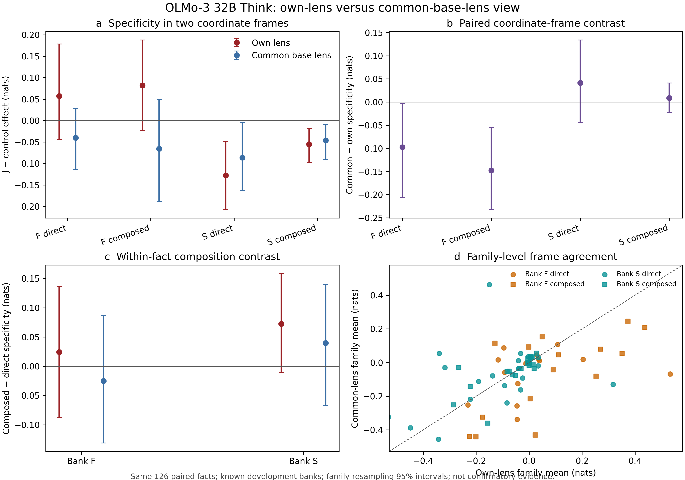

# J-space Phase 4 development report

Status: live development synthesis through OLMo-3 32B Think own/common
lens analysis, 2026-07-31.

This document is a living report, not a frozen claim record. Every
result here uses known Phase 3 banks and a development cohort. It can
localize a training-trajectory pattern and expose coordinate-frame
sensitivity, but it cannot establish a binary lineage claim. No Phase 4
confirmatory or replication cell is licensed until the candidate
preregistration receives PI sign-off and a tagged freeze.

## Compute and provenance boundary

All model jobs ran on the NVIDIA RTX PRO 6000 Blackwell Server Edition.
Each producer hard-failed unless CUDA was visible in the same process,
performed an FP16 CUDA matrix-multiply smoke test before model load, and
recorded the GPU in its result envelope. The final common-lens grid used
about 81.1 GB of VRAM. Model compute never used CPU; CPU was reserved for
tests, hashes, statistics, figures, and document compilation.

The Phase 3 release is imported immutably as
`p4-import-phase3-release-v1`. Native Phase 4 evidence is event-sourced
in `reports/evidence_events.jsonl`. Registered artifacts are never
overwritten.

## OLMo-3 32B Think capability gate

Live evidence: `p4-g5-bank-olmo3-think-dev-v2`.

Prospective prefix-disjoint accepted-alias scoring produced 972 rows,
324 facts, and 72 families.

| View | Capability |
|---|---:|
| Overall | 0.6430 |
| Bank F | 0.4935 |
| Bank S | 0.8972 |
| Direct | 0.6574 |
| Composed | 0.4846 |
| Bridge supplied | 0.7870 |

The lineage cohort was fixed before interventions by requiring both
direct and composed generation capability within the same fact:
41/204 Bank-F facts and 85/120 Bank-S facts, or 126 facts and 252
direct/composed items.

The original G5 attempt stopped after 180 rows when accent folding made
`Río` and `Rio` ambiguous. The repaired canonical selector prefers exact
spelling, then permits only a unique normalized fallback. The partial
attempt is preserved; v2 is the live result.

## Think own-lens intervention point

Raw evidence: `p4-lineage-grid-olmo3-think-dev-v1`.

Analysis: `p4-lineage-analysis-olmo3-think-dev-v1`.

The grid scored baseline, span-safe J, exact rank/energy control,
label-protected J, protected-energy control, mechanics-random control,
and logit-space label protection over every accepted alias. All 252
items are paired. Baseline replay drift is at most `7.15e-7` nats,
matched rank agreement is 100%, matched energy relative error is at most
`0.000230`, and span-safe selected/protected overlap is zero.

Family-weighted J-specific effects are:

| Cell | Estimate (nats) | Family-bootstrap 95% interval |
|---|---:|---:|
| Bank F direct | +0.0574 | [−0.0442, +0.1785] |
| Bank F composed | +0.0818 | [−0.0223, +0.1878] |
| Bank S direct | −0.1277 | [−0.2072, −0.0494] |
| Bank S composed | −0.0553 | [−0.0982, −0.0187] |

Bank-S composed-minus-direct specificity is `+0.0724`, with an interval
that crosses zero. This is compatible with the unusual positive
composition term seen at 3.1 Think beginning by 3.0, but it is not a
resolved anomaly. The planned controlled Bank-W redundancy and
internal-derivation axes must adjudicate it.

## Common-base-lens audit and repair

Final raw evidence:
`p4-lineage-grid-olmo3-think-common-base-lens-dev-v3`.

The common coordinate is the frozen OLMo base lens, SHA-256
`92f32e38dc4dffc45dda4e0c34a75f5433238f2046ae00046a4fe3fe1226b696`.

Two failures were useful:

1. V1 revealed rank-limited protected-energy sites where a requested
   in-span/out-of-span component was omitted without marking the site
   clamped.
2. V2 repaired that metadata, but changing the evidence ID also changed
   every matched/random scientific seed.

V3 freezes an explicit scientific-seed namespace to the original v1
namespace. Its acceptance audit shows:

- all seven aggregate outcome columns match v1 exactly, maximum
  absolute difference `0.0`;
- every per-alias score and condition order matches v1 exactly;
- 296 protected-energy alias summaries are correctly reclassified;
- maximum unclamped energy relative error falls from the erroneous
  `0.511283` diagnostic to `0.000239`;
- rank agreement remains 100%.

V3 supersedes both withdrawn attempts. The repair changes metadata, not
the scientific outcomes.

## Own lens versus common base lens

Live evidence: `p4-lens-frame-analysis-olmo3-think-dev-v1`.

The comparison pairs the same 252 items exactly and has zero baseline
drift.

| Cell | Own lens | Common base lens | Common − own |
|---|---:|---:|---:|
| F direct | +0.0574 | −0.0403 | −0.0977 [−0.2060, −0.0034] |
| F composed | +0.0818 | −0.0656 | −0.1474 [−0.2320, −0.0553] |
| S direct | −0.1277 | −0.0861 | +0.0416 [−0.0449, +0.1340] |
| S composed | −0.0553 | −0.0464 | +0.0089 [−0.0222, +0.0412] |

Bank F changes from small positive own-lens estimates to small negative
common-lens estimates. Both paired Bank-F frame contrasts have
family-bootstrap intervals below zero. Bank S is more frame-robust:
direct and composed estimates remain negative in both frames, and their
paired frame differences are interval-crossing.

The Bank-S composition estimate is `+0.0724` under the own lens and
`+0.0397` under the common lens; common-minus-own is `−0.0327`, with an
interval crossing zero. Item-level own/common specificity correlation
is 0.614 and family-level correlation is 0.495.

## Current interpretation

The 3.0 Think point supports an estimation-first account:

- Bank-S direct and composed specificity is already negative and is
  comparatively stable across fitted coordinate frames.
- Bank-F conclusions depend materially on whether the checkpoint uses
  its own fitted lens or the frozen base coordinate.
- Coordinate drift is therefore part of the scientific result, not
  merely a nuisance to hide.
- The positive Bank-S composition tendency is not yet precise and must
  not be promoted before a controlled load/redundancy experiment.

These observations strengthen the need for both common-lens and
own-lens trajectory lines. They do not license “lineage present” or
“lineage absent.”

## Next boundary

The next GPU block is the pinned OLMo-3 base checkpoint:
`allenai/Olmo-3-1125-32B@c2b61dae89a1ad10e4ad5653d0e46b590902607b`.
Run G5, freeze its capable direct/composed cohort, then run the same
seven-condition grid with the already banked base lens. Afterward,
synthesize base → 3.0 Think → 3.1 Think/Instruct with both own and common
lens trajectories.

If the two trajectory views disagree, the next priority is the
fit-size/corpus study before further causal interpretation. Confirmatory
Phase 4 remains blocked on preregistration freeze and untouched data.
