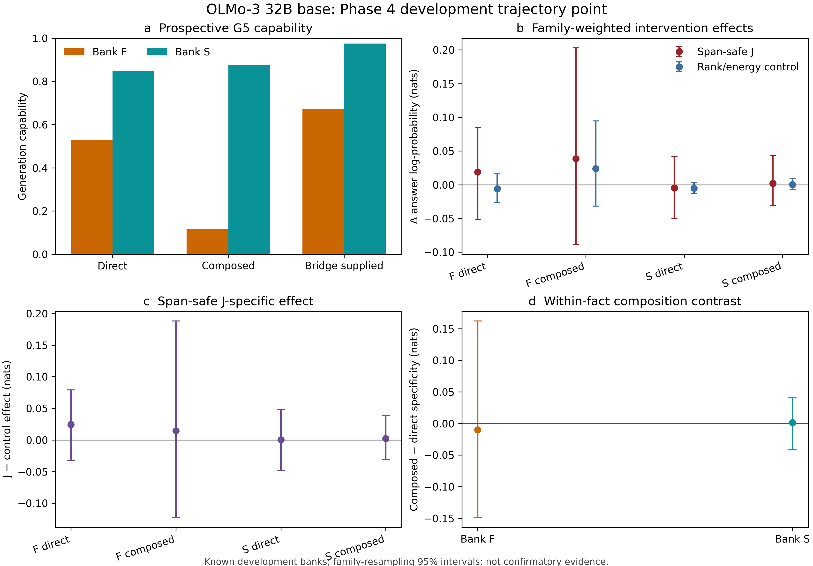
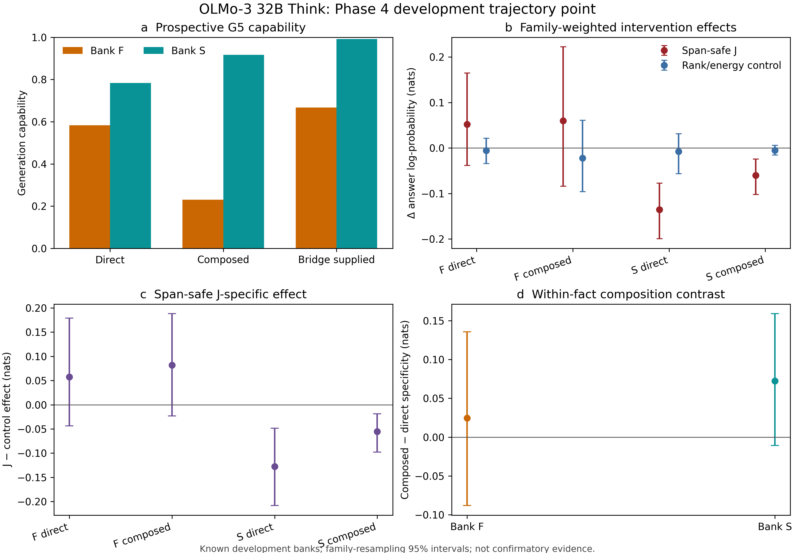
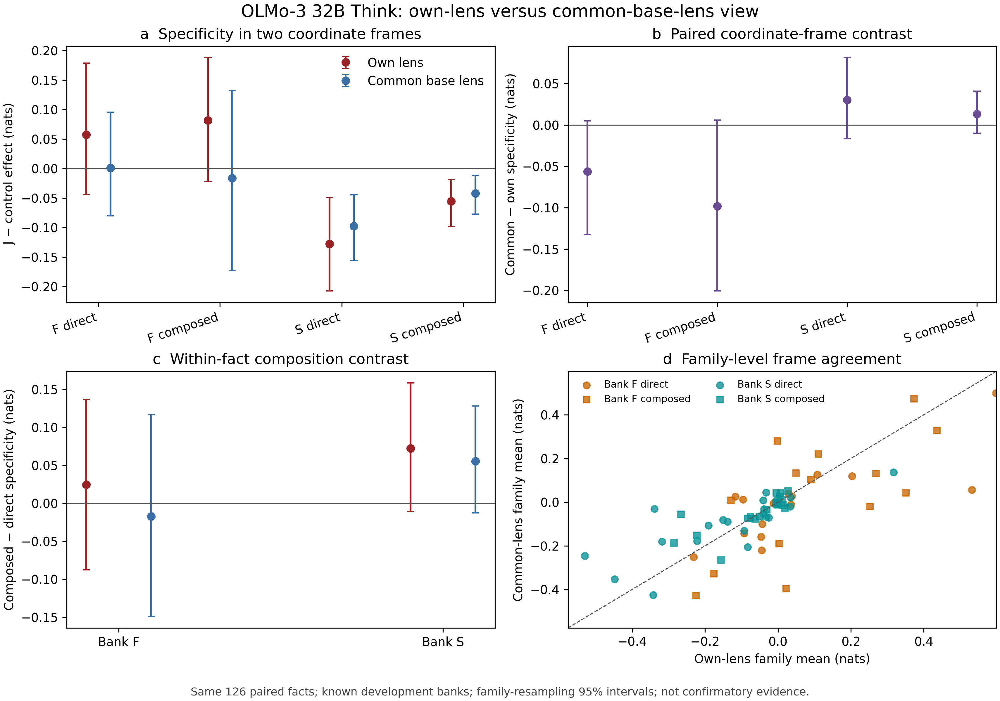
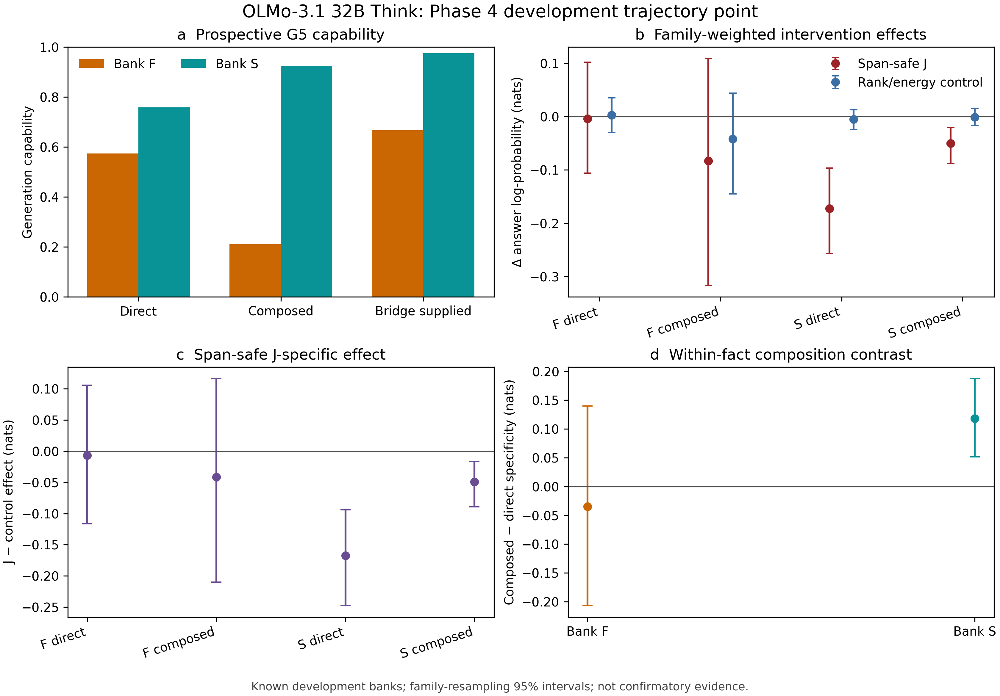
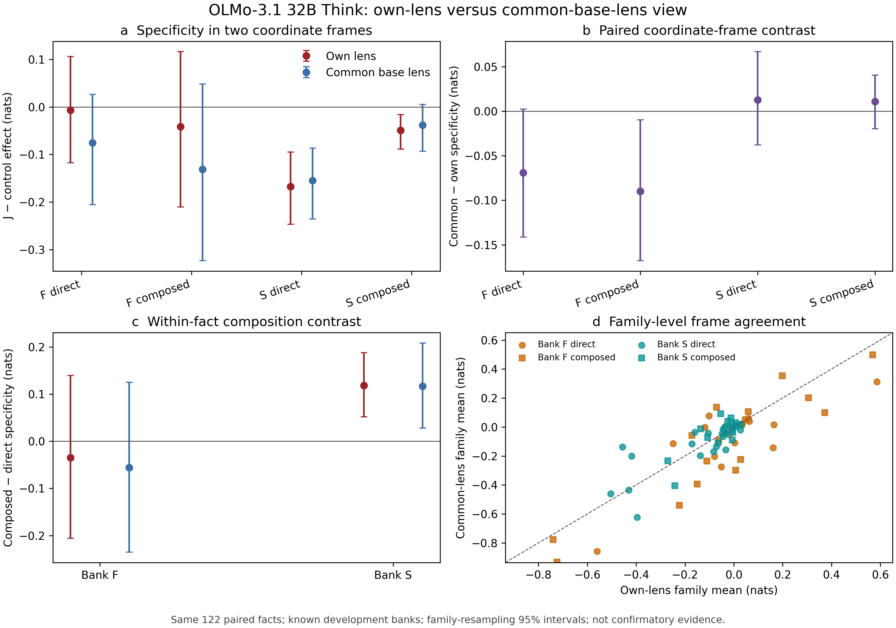
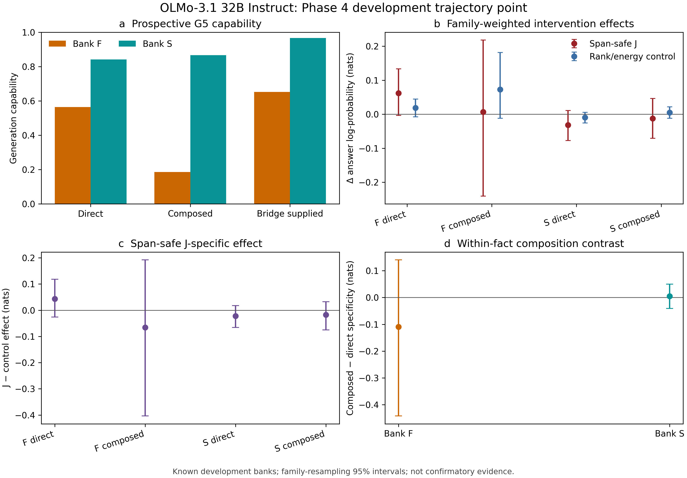
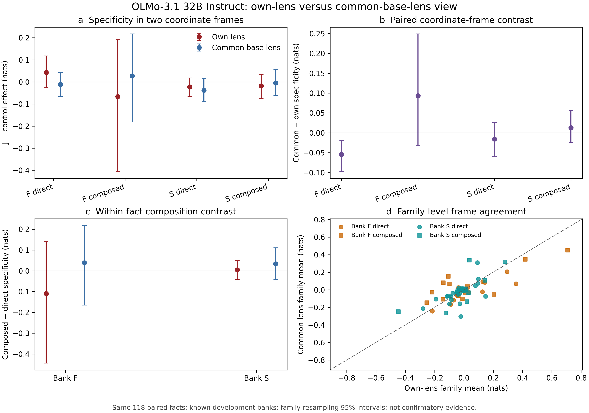

# J-space Phase 4 development report

Status: live development synthesis through the OLMo-3 32B base,
seed-paired 3.0 Think, and seed-paired OLMo-3.1 32B Think and Instruct
own/common-lens comparisons, 2026-07-31.

This document is a living report, not a frozen claim record. Every
result here uses known Phase 3 banks and a development cohort. It can
localize a training-trajectory pattern and expose coordinate-frame
sensitivity, but it cannot establish a binary lineage claim. No Phase 4
confirmatory or replication cell is licensed until the candidate
preregistration receives PI sign-off and a tagged freeze.

## Compute and provenance boundary

All model jobs ran on the NVIDIA RTX PRO 6000 Blackwell Server Edition.
Each producer hard-failed unless CUDA was visible in the same process,
performed an FP16 CUDA matrix-multiply smoke test before model load, and
recorded the GPU in its result envelope. The final common-lens and base
grids used about 81.1 GB of VRAM. Model compute never used CPU; CPU was
reserved for tests, hashes, statistics, figures, and document
compilation.

The Phase 3 release is imported immutably as
`p4-import-phase3-release-v1`. Native Phase 4 evidence is event-sourced
in `reports/evidence_events.jsonl`. Registered artifacts are never
overwritten.

## OLMo-3 32B Think capability gate

Live evidence: `p4-g5-bank-olmo3-think-dev-v2`.

Prospective prefix-disjoint accepted-alias scoring produced 972 rows,
324 facts, and 72 families.

| View | Capability |
|---|---:|
| Overall | 0.6430 |
| Bank F | 0.4935 |
| Bank S | 0.8972 |
| Direct | 0.6574 |
| Composed | 0.4846 |
| Bridge supplied | 0.7870 |

The lineage cohort was fixed before interventions by requiring both
direct and composed generation capability within the same fact:
41/204 Bank-F facts and 85/120 Bank-S facts, or 126 facts and 252
direct/composed items.

The original G5 attempt stopped after 180 rows when accent folding made
`Río` and `Rio` ambiguous. The repaired canonical selector prefers exact
spelling, then permits only a unique normalized fallback. The partial
attempt is preserved; v2 is the live result.

## OLMo-3 32B base capability and intervention point

Capability evidence: `p4-g5-bank-olmo3-base-dev-v1`.

Raw grid: `p4-lineage-grid-olmo3-base-dev-v1`.

Analysis: `p4-lineage-analysis-olmo3-base-dev-v1`.

The exact pinned base revision is
`c2b61dae89a1ad10e4ad5653d0e46b590902607b`. Prospective G5 scoring
produced 972 rows, 324 facts, and 72 families. Overall capability was
0.6101 (Bank F 0.4395; Bank S 0.9000). Requiring both direct and
composed capability fixed a pre-intervention cohort of 23 Bank-F facts
and 88 Bank-S facts, or 111 facts and 222 items.

The seven-condition grid passed its strict acceptance audit: baseline
replay drift was at most `6.71e-7` nats, span-safe selected/protected
overlap was exactly zero, matched rank agreement was 100%, and maximum
matched energy relative error was `0.000260`.

Family-weighted J-specific effects were near zero in every primary
cell:

| Cell | Estimate (nats) | Family-bootstrap 95% interval |
|---|---:|---:|
| Bank F direct | +0.0245 | [−0.0330, +0.0792] |
| Bank F composed | +0.0145 | [−0.1226, +0.1881] |
| Bank S direct | +0.0005 | [−0.0487, +0.0481] |
| Bank S composed | +0.0021 | [−0.0309, +0.0385] |

The base Bank-S composed-minus-direct contrast was `+0.0016`
`[−0.0417,+0.0403]`. This primary null does not reflect an inert
experiment: the overall label-protected J-specific effect was `+0.1231`
`[+0.0667,+0.1802]`, while mechanics-random and logit-protected effects
were respectively `−0.1048` and `−0.2023`, with intervals below zero.

## Think own-lens intervention point

Raw evidence: `p4-lineage-grid-olmo3-think-dev-v1`.

Analysis: `p4-lineage-analysis-olmo3-think-dev-v1`.

The grid scored baseline, span-safe J, exact rank/energy control,
label-protected J, protected-energy control, mechanics-random control,
and logit-space label protection over every accepted alias. All 252
items are paired. Baseline replay drift is at most `7.15e-7` nats,
matched rank agreement is 100%, matched energy relative error is at most
`0.000230`, and span-safe selected/protected overlap is zero.

Family-weighted J-specific effects are:

| Cell | Estimate (nats) | Family-bootstrap 95% interval |
|---|---:|---:|
| Bank F direct | +0.0574 | [−0.0442, +0.1785] |
| Bank F composed | +0.0818 | [−0.0223, +0.1878] |
| Bank S direct | −0.1277 | [−0.2072, −0.0494] |
| Bank S composed | −0.0553 | [−0.0982, −0.0187] |

Bank-S composed-minus-direct specificity is `+0.0724`, with an interval
that crosses zero. This is compatible with the unusual positive
composition term seen at 3.1 Think beginning by 3.0, but it is not a
resolved anomaly. The planned controlled Bank-W redundancy and
internal-derivation axes must adjudicate it.

## Common-base-lens audit and repair

Live standalone audit evidence:
`p4-lineage-grid-olmo3-think-common-base-lens-dev-v3`.

Live seed-paired evidence:
`p4-lineage-grid-olmo3-think-common-base-lens-dev-v4`.

The common coordinate is the frozen OLMo base lens, SHA-256
`92f32e38dc4dffc45dda4e0c34a75f5433238f2046ae00046a4fe3fe1226b696`.

Two failures were useful:

1. V1 revealed rank-limited protected-energy sites where a requested
   in-span/out-of-span component was omitted without marking the site
   clamped.
2. V2 repaired that metadata, but changing the evidence ID also changed
   every matched/random scientific seed.

V3 freezes an explicit scientific-seed namespace to the original v1
namespace. Its acceptance audit shows:

- all seven aggregate outcome columns match v1 exactly, maximum
  absolute difference `0.0`;
- every per-alias score and condition order matches v1 exactly;
- 296 protected-energy alias summaries are correctly reclassified;
- maximum unclamped energy relative error falls from the erroneous
  `0.511283` diagnostic to `0.000239`;
- rank agreement remains 100%.

V3 supersedes both withdrawn diagnostic attempts. It remains valid
standalone evidence, but its seed namespace does not pair with the
own-lens grid.

V4 reruns the common lens under the own-grid namespace,
`p4-lineage-grid-olmo3-think-dev-v1`. Its 252 rows form 126 exact
direct/composed pairs. Every condition order matches the own-lens grid,
baseline drift is zero between frames and at most `7.15e-7` versus G5,
matched rank agreement is 100%, maximum matched energy relative error
is `0.000205`, and span-safe overlap is zero. The deterministic
baseline and J-arm outcomes match v3 exactly; only stochastic controls
change with the corrected random streams.

## Own lens versus common base lens — corrected paired analysis

Live analysis: `p4-lens-frame-analysis-olmo3-think-dev-v2`.

Withdrawn analysis: `p4-lens-frame-analysis-olmo3-think-dev-v1`.

V1 mixed lens change with a change in matched-control RNG and remains
withdrawn. The hardened producer now refuses unequal scientific seed
namespaces. V2 pairs the own-lens grid with common-lens v4 under the
same namespace and identical per-item condition order. The entire
100,000-draw payload reproduced exactly, including all bootstrap
distribution hashes.

Family-weighted J-specific effects and paired frame deltas are:

| Cell | Own lens (95% interval) | Common base lens (95% interval) | Common − own (95% interval) |
|---|---:|---:|---:|
| F direct | +0.0574 [−0.0442, +0.1785] | +0.0010 [−0.0801, +0.0953] | −0.0563 [−0.1324, +0.0049] |
| F composed | +0.0818 [−0.0223, +0.1878] | −0.0164 [−0.1725, +0.1323] | −0.0982 [−0.2005, +0.0058] |
| S direct | −0.1277 [−0.2072, −0.0494] | −0.0974 [−0.1557, −0.0446] | +0.0303 [−0.0165, +0.0813] |
| S composed | −0.0553 [−0.0982, −0.0187] | −0.0419 [−0.0769, −0.0116] | +0.0134 [−0.0100, +0.0408] |

No paired frame-delta interval excludes zero. Bank-S direct and
composed effects are negative with intervals below zero in both tested
coordinate frames. Bank-F effects remain imprecise in both frames.
Item- and family-level frame correlations are `0.7557` and `0.7254`;
the item mean absolute frame difference is `0.1025` nats. The
common-minus-own composition deltas are `−0.0419`
`[−0.1471,+0.0685]` for Bank F and `−0.0169`
`[−0.0661,+0.0319]` for Bank S.

The RNG repair behaves diagnostically as expected: J frame deltas are
unchanged from withdrawn v1, while the corrected controls move the
Bank-F direct and composed specificity deltas `+0.0413` and `+0.0492`
nats toward zero. Family correlation rises from `0.4946` to `0.7254`.

## OLMo-3.1 32B Think capability and own-lens point

Capability evidence: `p4-g5-bank-olmo31-think-dev-v1`.

Raw own-lens grid: `p4-lineage-grid-olmo31-think-dev-v1`.

Live own-frame analysis: `p4-lineage-analysis-olmo31-think-dev-v2`.

The exact pinned revision is
`832c3f543499af8fe68b88359501de9cb7840544`. Its RTX-backed G5 run
produced 972 rows, 324 facts, and 72 families.

| View | Boundary-safe prefix capability |
|---|---:|
| Overall | 0.6327 |
| Bank F | 0.4837 |
| Bank S | 0.8861 |
| Direct | 0.6420 |
| Composed | 0.4753 |
| Bridge supplied | 0.7809 |

Requiring both direct and composed capability fixed 38 Bank-F facts
and 84 Bank-S facts, or 122 facts / 244 items. The overall rate is
lower than Phase 3's historical 0.7346 because Phase 3 selected an
accepted alias anywhere in the eight-token continuation. This is not
generation drift: all 972 continuations are byte-identical across
phases, and all Phase 4 flags exactly match Phase 3's later
boundary-safe prefix audit.

The own-lens grid passed the full conformance audit: maximum G5
baseline replay drift `8.64e-7` nats, zero span-safe overlap, 100%
rank agreement over 564 matched summaries, and maximum matched energy
relative error `0.000222`.

Family-weighted J-specific effects are:

| Cell | Estimate (nats) | Family-bootstrap 95% interval |
|---|---:|---:|
| Bank F direct | −0.0067 | [−0.1162, +0.1057] |
| Bank F composed | −0.0416 | [−0.2099, +0.1167] |
| Bank S direct | −0.1674 | [−0.2477, −0.0942] |
| Bank S composed | −0.0491 | [−0.0891, −0.0165] |

Bank-S composed-minus-direct specificity is `+0.1183`
`[+0.0514,+0.1879]`, with descriptive exact sign-flip
`p=0.0031`. The original v1 analysis has an identical numerical
payload but is withdrawn because its figure footer crowded the
lower-panel labels. V2 reserves the footer margin; all 28 independently
reconstructed bootstrap/sign-flip distributions remain exact.

## OLMo-3.1 Think seed-paired coordinate comparison

Common-lens grid:
`p4-lineage-grid-olmo31-think-common-base-lens-dev-v1`.

Paired analysis:
`p4-lens-frame-analysis-olmo31-think-dev-v1`.

The common grid uses the frozen base lens and the exact own-grid
scientific namespace. All 244 item IDs and condition orders pair
exactly; between-frame baseline drift is zero. Its standalone audit
shows G5 replay drift `8.64e-7` nats, zero span-safe overlap, 100% rank
agreement, and maximum energy error `0.000256`. Mechanics-random and
logit-protected outcomes are bit-identical between frames.

Family-weighted J-specific effects and paired frame deltas are:

| Cell | Own lens (95% interval) | Common base lens (95% interval) | Common − own (95% interval) |
|---|---:|---:|---:|
| F direct | −0.0067 [−0.1172, +0.1057] | −0.0757 [−0.2055, +0.0264] | −0.0690 [−0.1413, +0.0025] |
| F composed | −0.0416 [−0.2105, +0.1162] | −0.1314 [−0.3231, +0.0484] | −0.0898 [−0.1677, −0.0096] |
| S direct | −0.1674 [−0.2470, −0.0951] | −0.1547 [−0.2358, −0.0868] | +0.0127 [−0.0378, +0.0669] |
| S composed | −0.0491 [−0.0888, −0.0162] | −0.0381 [−0.0933, +0.0055] | +0.0110 [−0.0196, +0.0406] |

The Bank-F composed common-minus-own interval is below zero; the other
three frame-delta intervals include zero. This is evidence of
coordinate sensitivity for that known-bank cell, even though the
effect itself remains imprecise in both frames. Bank-S direct remains
negative with intervals below zero in both frames. Bank-S composed is
negative in the own frame, while the common-frame interval narrowly
crosses zero.

The Bank-S composition contrast is positive in both frames: own
`+0.1183 [+0.0517,+0.1876]`, common
`+0.1166 [+0.0279,+0.2080]`; their paired delta is
`−0.0017 [−0.0551,+0.0504]`. Item/family frame correlations are
`0.7679` / `0.8386`, and mean absolute item shift is `0.1133` nats.
All 42 bootstrap and 6 exact sign-flip distributions were
independently reconstructed exactly.

## OLMo-3.1 32B Instruct capability and own-lens point

Capability evidence: `p4-g5-bank-olmo31-instruct-dev-v1`.

Raw own-lens grid: `p4-lineage-grid-olmo31-instruct-dev-v1`.

Own-frame analysis: `p4-lineage-analysis-olmo31-instruct-dev-v1`.

The exact pinned revision is
`ac0587e4a7744a551c059d8cd17ba220bc940dae`. Its RTX-backed G5 run
produced 972 rows, 324 facts, and 72 families.

| View | Boundary-safe prefix capability |
|---|---:|
| Overall | 0.6245 |
| Bank F | 0.4673 |
| Bank S | 0.8917 |
| Direct | 0.6667 |
| Composed | 0.4383 |
| Bridge supplied | 0.7685 |

Requiring both direct and composed capability fixed 32 Bank-F facts
and 86 Bank-S facts, or 118 facts / 236 items. All 972 generations are
byte-identical to the Phase 3 run, and all capability flags exactly
match the later boundary-safe prefix audit.

The own-lens grid has maximum G5 baseline replay drift `7.75e-7` nats,
zero span-safe overlap, 100% rank agreement over 528 matched summaries,
and maximum matched-energy relative error `0.000228`.

Family-weighted J-specific effects are:

| Cell | Estimate (nats) | Family-bootstrap 95% interval |
|---|---:|---:|
| Bank F direct | +0.0432 | [−0.0259, +0.1181] |
| Bank F composed | −0.0662 | [−0.4037, +0.1921] |
| Bank S direct | −0.0224 | [−0.0656, +0.0179] |
| Bank S composed | −0.0177 | [−0.0755, +0.0325] |

Bank-S composed-minus-direct specificity is `+0.0047`
`[−0.0411,+0.0501]`. All four primary intervals include zero, unlike
the 3.1 Think Bank-S cells. All 22 family bootstraps and 6 exact
sign-flip distributions were independently reconstructed exactly.

## OLMo-3.1 Instruct seed-paired coordinate comparison

Common-lens grid:
`p4-lineage-grid-olmo31-instruct-common-base-lens-dev-v1`.

Paired analysis:
`p4-lens-frame-analysis-olmo31-instruct-dev-v1`.

The own/common grids use identical 236-item cohort manifests,
condition orders, and scientific RNG namespaces. Between-frame
baseline drift is exactly zero; both frames replay G5 within
`7.75e-7` nats. Both have zero span-safe overlap and 100% rank
agreement. Maximum matched-energy relative error is `0.000228` in the
own frame and `0.000212` in the common frame. Mechanics-random and
logit-protected outcomes are bit-identical between frames.

Family-weighted J-specific effects and paired frame deltas are:

| Cell | Own lens (95% interval) | Common base lens (95% interval) | Common − own (95% interval) |
|---|---:|---:|---:|
| F direct | +0.0432 [−0.0263, +0.1173] | −0.0111 [−0.0655, +0.0417] | −0.0542 [−0.0970, −0.0194] |
| F composed | −0.0662 [−0.4050, +0.1920] | +0.0271 [−0.1813, +0.2170] | +0.0934 [−0.0312, +0.2488] |
| S direct | −0.0224 [−0.0657, +0.0178] | −0.0379 [−0.0891, +0.0159] | −0.0155 [−0.0603, +0.0258] |
| S composed | −0.0177 [−0.0753, +0.0332] | −0.0045 [−0.0609, +0.0564] | +0.0131 [−0.0240, +0.0558] |

The Bank-F direct common-minus-own interval is below zero. Its
descriptive exact sign-flip value is `p=0.0057`. The Bank-F
composition contrast also changes across frames: own
`−0.1094 [−0.4439,+0.1404]`, common
`+0.0382 [−0.1652,+0.2172]`, paired delta
`+0.1476 [+0.0257,+0.2978]` (`p=0.0363`). All Bank-S effects,
composition contrasts, and frame deltas include zero.

Item/family frame correlations are `0.7523` / `0.8521`, and mean
absolute item shift is `0.0819` nats. All 42 bootstrap and 6 exact
sign-flip distributions were independently reconstructed exactly.

## Current interpretation

The base-to-3.0/3.1 Think/Instruct trajectory supports an
estimation-first account:

- The base checkpoint is near zero in all four primary specificity
  cells, including both Bank-S variants.
- Bank-S direct and composed specificity is negative with intervals
  below zero in both seed-paired 3.0 Think coordinate frames. Their
  paired frame-delta intervals include zero. This is development
  evidence of robustness across the two tested frames, not a
  confirmatory invariance claim.
- Thus the known-bank development data localize the emergence of the
  Bank-S negative effect to the base-to-Think training interval. The
  cohorts differ because capability was fixed separately at each
  checkpoint, so this is a trajectory localization, not a paired causal
  estimate.
- At 3.1 Think, Bank-S direct remains negative in both frames.
  Bank-S composed is negative in the own frame but imprecise in the
  common frame. The positive composed-minus-direct contrast is now
  precise in both frames and stable under the paired lens change.
- At the sibling 3.1 Instruct checkpoint, all Bank-S specificity and
  composition intervals include zero in both frames. The 3.1 Think
  Bank-S pattern therefore does not transfer to Instruct under these
  development cohorts. Because capability cohorts and post-training
  objectives differ, this is trajectory localization rather than a
  paired causal mode effect.
- Bank-F cell effects remain individually imprecise, but coordinate
  choice matters: the 3.1 Think composed frame delta is below zero,
  while 3.1 Instruct has a negative direct frame delta and a positive
  composition frame delta with intervals excluding zero. Coordinate
  frame must remain explicit in every lineage synthesis.
- The precise 3.1 Bank-S composition contrast is a development finding,
  not an explanation. The controlled Bank-W load/redundancy and
  internal-derivation axes still need to adjudicate its mechanism.

These observations strengthen the need for seed-paired common-lens and
own-lens trajectory lines. They do not license “lineage present” or
“lineage absent.”

## Next boundary

The pinned base, corrected 3.0 Think, and corrected 3.1 Think/Instruct
development points are complete and banked. Next build the registered
cross-checkpoint trajectory table/figure with common-lens and own-lens
views kept separate. The observed frame and sibling-checkpoint
disagreements make the fit-size/corpus study the next experimental
priority before stronger causal interpretation.

Confirmatory Phase 4 remains blocked on preregistration freeze and
untouched data.
