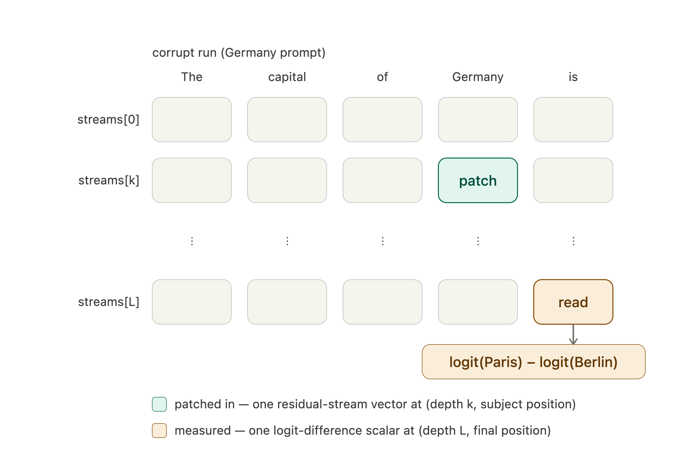

# Lab 5: Activation Patching and Causal Tracing

**Evidence level targeted:** causality (`CAUSAL`), scoped to a prompt population, metric, and intervention. With the optional editing extension, the lab also shows the gap between *localizing* a fact and *changing* it.

**Prerequisites:** Labs 1-4. Lab 1 gave the residual-stream indexing and "readout is an instrument" caution. Lab 2 showed that attribution (a ledger) is not causation. Lab 3 showed that routing (attention pattern) and contribution (what is written) are different. Lab 4 showed that decodable does not mean used. Lab 5 is where the experiment finally reaches into the forward pass and moves something: interchange interventions on the residual stream.

## The question

Which activations are causally responsible for a behavior? Concretely: where in the forward pass is the fact

```text
The capital of France is -> Paris
```

recoverable after the prompt has been corrupted to a different country, and what happens if we try to turn that localization into a weight edit?

## The method: interchange interventions

Run a clean prompt and a corrupt prompt:

```text
Clean:     The capital of France is       target:     Paris
Corrupt:   The capital of Germany is      distractor: Berlin
```

Then splice one activation from the clean run into the corrupt run at one stream depth and one token position. Measure how much of the clean behavior returns:

```text
recovery = (patched_diff - corrupt_diff) / (clean_diff - corrupt_diff)
diff     = logit(" Paris") - logit(" Berlin") at the final position
```

A recovery of 1.0 means the patch restored the whole clean-vs-corrupt logit gap. A recovery of 0.0 means the readout could use none of it. A negative value means the patch made the corrupt run even less clean-like.

This is causal evidence because the internal state was changed while the prompt and model weights were otherwise held fixed.

## What you patch is a vector, not a logit

The most common confusion here is what the spliced object actually *is*. It is a **residual-stream hidden state**: `streams[k]` at one token position is a single `d_model`-dimensional vector — the accumulated hidden state at that layer and that token. It is not "one logit" and not "the whole set of logits." There are no logits inside the stream. Logits exist only once, at the very end, after the final norm and unembed — and in this lab they appear only in the *measurement*, never in the thing you intervene on.

So the experiment has two completely separate objects, and they usually live at different cells:

- **what you splice in:** a residual-stream vector at one `(depth, position)` cell — the teal cell below.
- **what you read out:** a single scalar, `logit(" Paris") - logit(" Berlin")`, at the final position only — the amber cell.



The teal cell is the only thing that changes in the corrupt run; everything else is left alone. The amber cell is the only thing you measure. The lab sweeps the patched cell across every cell in the grid and records the amber scalar each time — **that whole grid of scalars is the causal trace**. The per-fact heatmaps in `plots/patching_heatmap_<fact>.png` are exactly this grid for one pair.

This also fixes the noun for the next section. Saying "`streams[k]` contains everything written by blocks `< k`" is the right idea with the wrong word if you call it logits — call them hidden states. The residual stream is additive: each block reads it, computes, and adds its output back, so `streams[k] = embeddings + Σ(outputs of blocks 0..k-1)`. Patching `streams[k]` overwrites that running sum of hidden states; there are no intermediary logits in there. You *can* project a mid-stream vector to vocab space with a logit lens (Lab 1), but that is an instrument you point at the stream, not what is stored in it.

## The load-bearing convention: stream depth is not component layer

The bench names the residual stream this way:

```text
streams[0] = embedding output, before block 0
streams[k] = residual stream after k blocks, also the input to block k
streams[L] = residual stream after all L blocks, before final norm
```

So a patch at `streams[k]` contains everything written by blocks `< k`. If the localized stream depth is 13, the nearest component layer that could have *written* that stream is block 12. The revised lab writes this mapping into:

```text
diagnostics/localization_decision.json
```

Read that file before comparing the residual-stream patch to the component patch or the rank-one edit. Otherwise it is easy to make a one-layer-late claim with a perfectly polished plot, the most elegant wrong turn in the maze.

## Alignment is the whole game

Clean and corrupt pairs must differ in exactly one single-token subject position. The validator rejects a pair if:

- the subject or answer is not a single token;
- the clean and corrupt prompts have different token lengths;
- the prompts differ at any position other than the declared subject position.

The report is written to:

```text
diagnostics/tokenization_report.csv
```

Do not skim it. The field's classic patching bug is comparing position 3 in one prompt to position 3 in a prompt that tokenized differently.

## Instrument checks before science

The lab runs the bench self-checks before measuring recovery:

| Diagnostic | Why it matters |
|---|---|
| `diagnostics/hook_parity.json` | block hooks match the residual-stream convention |
| `diagnostics/logit_lens_self_check.json` | final-depth lens reproduces the model logits |
| `diagnostics/patch_noop_check.json` | patching a run with its own vectors is identity |
| `diagnostics/component_anatomy.json` | attn/MLP contribution hook points are verified, not guessed |
| `diagnostics/dla_decomposition_check.json` | captured components sum to the final pre-norm residual stream |

If any of these fail, stop. A failed self-check does not make the result noisy; it makes the object undefined.

## What makes it causal tracing rather than a demo

One clean/corrupt pair is a demonstration. Causal tracing is the aggregate:

1. Validate a dataset of capital facts.
2. Gate out facts the model does not know, using clean and corrupt logit margins.
3. Patch every stream depth and token position for every kept base-template pair.
4. Aggregate recovery by token role: pre-subject, subject, post-subject, last.
5. Confirm the subject curve on two paraphrase templates.
6. Run negative controls: mismatched-pair patches, wrong-position patches, and a split-heldout low-region check. These are the specificity checks that turn a nice curve into a scoped causal claim.
7. Refine the localized stream band with component-level patching: attention output versus MLP output.
8. Optionally run a rank-one edit audit.

**Make the concept pop (controls):** Look at `plots/negative_controls.png` and `tables/negative_control_scores.csv`. The matched representative patch recovers ~0.67 while mismatched-pair controls recover ~0.29 and wrong-position ~0.18. The gap is the evidence that the recovered signal is fact-specific, not just "a large vector was injected."

The output is not just a heatmap. The output is a claim card with a scope, a metric, a control battery, and caveats.

The upgraded plotting pass adds a second layer of discipline: every visually appealing curve now has nearby artifacts asking whether the curve survives per-fact heterogeneity, paraphrase changes, and negative controls. Read patching results as an evidence table: intervention, population, metric, counterexample, and only then the claim.

## How to read the main curves

At stream depth 0, patching the subject position mostly substitutes the token embedding. For this corruption type, high subject recovery at depth 0 is a tautology, not a localization result.

The science starts after depth 0:

**Make the concept pop:** Look at `plots/localization_across_facts.png`. The subject curve stays high then collapses (handoff); the last curve rises late. Then look at the edit results (if you ran `--run-edit`): even at the "best" localized layer, direct success is often 0 and neighbors start to break before the target fact flips. This is the famous localization-vs-editing gap (Hase et al.). The numbers that matter are "recovery at handoff" vs "edit success at that layer vs alternative layer".

- The **subject-position curve** tells you where the clean subject representation still causally helps the corrupt run recover the target answer.
- The **handoff** is where subject-position recovery collapses. The fact has been read out of the subject stream or moved into later computation.
- The **last-position curve** usually rises later. That is where the answer becomes directly available to the final readout.
- The **localized stream band** is the last non-tautological subject band before the handoff.
- The **component layers** are mapped from that stream band by subtracting one, because block `k - 1` writes `streams[k]`.

This is the recall-then-readout story in one figure. The component pass (attn vs MLP at subject vs last) refines the "where" into a candidate write site.

**Make the concept pop (component vs stream):** The stream patch at the localized band is an interchange result on the accumulated representation. The component-level pass (see `plots/component_patching.png`) asks which submodule's output, when patched, carries most of the recovery. It is still an interchange result, not a proof that the submodule "stores" the fact.

## Running it

```bash
python interp_bench.py --lab lab5 --tier a
python interp_bench.py --lab lab5 --tier b --prompt-set full
python interp_bench.py --lab lab5 --tier b --prompt-set full --run-edit
```

Useful knobs:

```bash
python interp_bench.py --lab lab5 --tier b --prompt-set medium
python interp_bench.py --lab lab5 --tier b --prompt-set full --max-examples 12
python interp_bench.py --lab lab5 --tier b --prompt-set full --showcase france
```

`--prompt-set small|medium|full` now controls the built-in fact count. A custom `.csv` or `.json` file can be passed as `--prompt-set` if it contains `fact_id`, `subject`, and `target` fields.

**Headline numbers note:** Full runs use ~20-25 validated capital facts (with 3 templates each) after baseline gating. Recovery percentages, handoff curves, and negative-control gaps are the primary evidence; the numbers describe behavior on this narrow factual-recall population and merit one-significant-figure confidence. Negative controls and paraphrase consistency are what scope the claim.

## Main artifacts

Read them in this order. The first pass validates the instrument, the second pass reads the causal trace, and the third pass audits overclaiming.

1. `causal_trace_card.md` - the deliverable card: scope, localization, controls, component result, edit result if run.
2. `diagnostics/localization_decision.json` - the handoff rule and the stream-depth-to-component-layer mapping. Keep this open while reading component and edit plots.
3. `tables/plot_reading_guide.csv` - the map from each upgraded plot to the concept it is meant to teach.
4. `plots/causal_patching_dashboard.png` - the one-screen overview: role timing, specificity controls, component refinement, and per-fact heterogeneity.
5. `plots/localization_across_facts.png`, `plots/recovery_ridge_map.png`, and `tables/role_transition_summary.csv` - the recall-then-readout timing story.
6. `plots/recovery_role_atlas.png`, `plots/per_fact_top_patch.png`, `tables/per_fact_top_patch.csv`, and `tables/patch_evidence_matrix.csv` - the heterogeneity audit: which facts drive the average, and where controls bite.
7. `plots/patching_heatmap_<fact>.png` - one pair, layer by position, token-labeled, with localized band marked. Read this after the aggregate plots, not before them.
8. `tables/facts.csv` - which pairs passed the baseline gate and why others dropped. The new `plots/baseline_gate_audit.png` makes the gate visible.
9. `tables/patching_scores.csv` and `results.csv` - the long-form grid behind every cell.
10. `tables/paraphrase_summary.csv`, `tables/paraphrase_consistency.csv`, and `plots/paraphrase_transfer_matrix.png` - whether the localized band survives wording changes.
11. `tables/negative_control_scores.csv`, `tables/specificity_summary.csv`, `plots/negative_controls.png`, and `plots/specificity_gap_by_fact.png` - specificity checks. The matched-vs-control gap is the evidence of fact-specific recovery.
12. `tables/component_patching.csv`, `tables/component_summary.csv`, `plots/component_patching.png`, and `plots/component_patch_matrix.png` - attention versus MLP refinement of the stream-level result.
13. `tables/edit_results.csv`, `tables/edit_audit_summary.csv`, and `plots/edit_audit_dashboard.png` - only if `--run-edit` was passed. This is the Hase audit: does localization predict the best edit layer?

## New synthesis tables

The upgraded code writes extra tables that are useful before drafting claims:

| Table | Why it exists |
|---|---|
| `tables/role_transition_summary.csv` | gives peak and threshold-crossing depths for each token role, so the handoff claim is not just eyeballed from a curve |
| `tables/specificity_summary.csv` | reports matched and negative-control distributions with gaps versus matched recovery |
| `tables/patch_evidence_matrix.csv` | one row per fact combining baseline margins, representative recovery, paraphrase transfer, and strongest control |

Use these tables to draft ledger claims before polishing prose. If the picture and the table disagree, trust the table and inspect the outlier.

## The extension: the patch made permanent

`--run-edit` applies a deliberately minimal rank-one edit to one MLP down-projection. It takes the clean subject's MLP key and shifts the MLP output toward the corrupt subject's output:

```text
clean key:    France at the localized component layer
new value:    Germany-like MLP output at that same position
intended edit: France -> Berlin
```

The edit audit asks:

| Measure | Question |
|---|---|
| direct success | did the original prompt flip to the distractor? |
| logit movement | did the target-vs-distractor gap move even without a flip? |
| paraphrase flips | did the fact change, or just the base template? |
| neighbors intact | did nearby capital facts keep the model's own pre-edit top-1 answer? |
| fluency logprob | did the edit damage unrelated text modeling? |

The localized edit layer is chosen from the mapped component layer, not from the stream depth directly. An alternative layer is also tested. That comparison is the point of the extension: causal tracing can identify where a clean activation is sufficient, while editing asks whether a small weight change at one module can reproduce that activation change robustly.

**Make the concept pop (edit audit):** Even when you apply the edit at the "best" layer from causal tracing, direct success is often false and neighbors can start to break before the target fact flips (see `tables/edit_results.csv`). This is the Hase et al. tension in action: localization (sufficiency of a difference under interchange) does not automatically predict editability under a rank-one weight change. The audit forces you to report the gap rather than assume it will be small.

A movement without a flip is not a failed artifact. It is often the most informative outcome. It says the edit touched the right direction but did not dominate the distributed computation.

## Writeup questions

1. Where is the handoff in your run? Quote the subject peak, threshold, handoff depth, and localized stream band from `localization_decision.json`.
2. Why is subject-position recovery at stream depth 0 uninformative for this corruption type? What corruption type would make early subject patches less tautological?
3. Do the paraphrase templates preserve the localized band? Quote `paraphrase_summary.csv`.
4. Which component-role cell is strongest in `component_summary.csv`: MLP at subject, attention at subject, MLP at last, or attention at last? Does it support or complicate the ROME-style story?
5. Do negative controls stay below the matched patch? Identify the strongest control and decide whether your claim needs to be narrowed.
6. State your strongest result as a Woodward-style invariance claim: under which intervention, over which prompt population, and for which metric does the relationship hold?
7. Extension: did the localized layer or alternative layer edit better? Explain the result without assuming localization should predict editability.

## Symptom-first debugging

| Symptom | First place to look |
|---|---|
| `patch_noop_check` failed | stream convention or patch hook is broken; ignore every heatmap until fixed |
| many rejected pairs | `diagnostics/tokenization_report.csv`; subjects or answers are not single tokens |
| only a few facts pass the gate | `tables/facts.csv`; the model may not know the facts under this template |
| recovery is mostly zero | check `clean_diff - corrupt_diff`; the denominator may be too small or the corrupt pair may not oppose the target |
| recovery is often above 1 or below -1 | single cells can do this; widespread extremes suggest denominator or alignment trouble |
| paraphrases localize elsewhere | scope the claim to the base template or inspect whether the subject position changed meaningfully |
| a negative control matches the real patch | do not claim specificity; inspect `plots/specificity_gap_by_fact.png`, `tables/specificity_summary.csv`, and the per-fact rows, then narrow the intervention |
| edit flips nothing | inspect `movement_toward_distractor` before declaring failure; the stream patch may be distributed across many writes |
| edit breaks neighbors | the edit is not specific enough; cite spillover as counterevidence |

## What goes in the claim ledger

Write 2-3 `CAUSAL` claims. Each claim needs four pieces:

```text
Intervention: clean subject-position stream patch at depth k
Population: validated single-token capital prompts under template T
Metric: recovery of target-vs-distractor final-position logit difference
Falsifier: a control, paraphrase, or broader population that would break the claim
```

Available claim:

```text
Patching the clean subject-position residual stream at depth k recovers X% of the clean logit gap across N validated capital prompts, while mismatched-pair controls recover Y%.
```

Not available:

```text
Layer k stores capitals.
```

The second sentence is tempting because it is short. It is also wrong-shaped. Lab 5 earns causal claims about interventions, not metaphysical claims about storage jars in the transformer attic.
